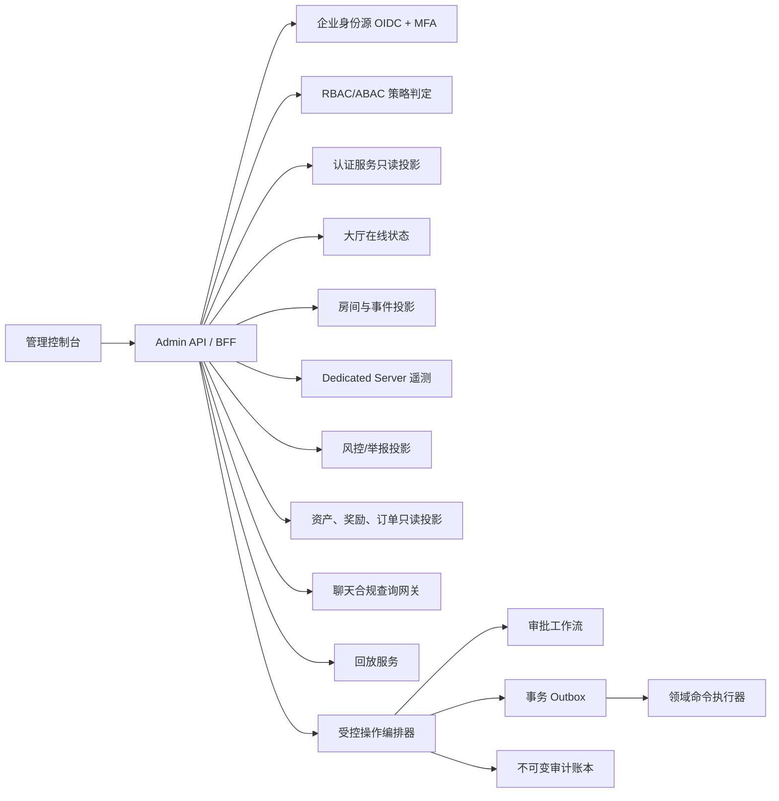

# 玩家实时监视与管理应用设计

## 1. 目标与安全边界

本应用面向客服、运营、风控、值班工程师和审计人员，提供玩家 360° 只读视图，
并在完成身份认证、授权、二次确认、审批和审计后执行受控管理操作。

不可突破的边界：

- 普通运营人员不得修改牌局过程、输赢结果、结算分数或排行榜结果。
- 管理应用不得持有玩家 Access Token、Refresh Token、认证签名密钥或原始设备安装标识。
- 查询权限和操作权限分离；审批人不得审批自己发起的操作。
- 所有写操作必须有原因、TraceId 和关联工单，并保存操作前后状态。
- 补偿只允许通过独立资产账本追加交易，不允许直接改余额。
- 审计记录只能追加，运行账号不具备 UPDATE/DELETE 权限。

## 2. 总体架构

管理控制台只访问 Admin API。Admin API 使用专用只读服务凭证查询各领域投影，
不得复用结算、分配或玩家登录凭证。写操作通过操作编排器投递到对应领域命令，
不直接写业务数据库。

## 3. 玩家 360° 数据模型

| 分类 | 字段 | 权威来源 | 默认刷新/保留 |
|---|---|---|---|
| 身份 | PlayerId、昵称、渠道、账号状态 | Auth/Account | 5 秒 / 账号生命周期 |
| 在线 | 在线状态、大厅、房间、游戏服务器 | Lobby/Room | 2–5 秒 / 30 天 |
| 连接 | 延迟、掉线、托管、会话状态 | Game telemetry | 2 秒 / 明细 30 天 |
| 设备 | 当前设备、设备历史、IP 网段 | Auth risk projection | 登录时 / 180 天 |
| 行为 | 登录、房间、举报、GM 操作 | Event projection | 准实时 / 180–365 天 |
| 风控 | 风险标签、处罚记录 | Risk/Sanction | 准实时 / 按合规要求 |
| 资产 | 资产变化、奖励领取 | Wallet/Reward ledger | 准实时 / 账本长期保留 |
| 支付 | 订单号、渠道、金额、状态 | Payment | 准实时 / 财务合规周期 |
| 聊天 | 授权范围内的消息查询 | Compliance gateway | 按需 / 最短必要周期 |
| 回放 | MatchId、回放状态、证据包 | Replay | 对局结束后 / 争议周期 |

跨服务关联统一使用 `PlayerId`、`RoomId`、`MatchId`、`TraceId`。管理查询不得依赖昵称、
IP 或设备作为主键。

## 4. 当前已落地的一期

当前代码已经提供以下只读链路：

- 玩家账号目录以及按 PlayerId/昵称搜索。
- 当前在线状态、所在大厅、当前房间和 Dedicated Server 实例。
- 当前延迟、最近登录、活跃会话数量。
- 脱敏 IP 网段和不可逆派生设备标识。
- 登录历史、设备历史、截断会话引用、房间历史和掉线事件。
- Admin、Auth、Lobby、Allocator 之间相互隔离的只读 Bearer 凭证。

一期不包含账号制裁账本、资产/支付/聊天/举报数据源和任何管理命令。当前账号状态固定
显示为 `Active`，不能被解释为已完成封禁状态同步。

房间管理二期已经加入角色化人员凭证、操作申请、手工输入目标的二次确认、异人审批、
状态序号并发检查和哈希链审计。审批通过后状态为 `ApprovedAwaitingExecution`；在
PostgreSQL/WORM 持久化、企业 OIDC/MFA 和事务 Outbox 执行器完成前，部署默认关闭管理
模式，也不会调用 Lobby/Allocator 高权限命令。

玩家管理二期复用同一安全工作流，已经覆盖强制下线、异常会话重置、冻结/封禁/解封、
禁言/解禁、风险标记、补偿、错误奖励撤销、回放和客服工单申请。玩家操作使用脱敏账号、
会话、在线、房间和服务器状态生成 SHA-256 状态指纹；确认或审批时指纹变化会拒绝继续。
`sanction.operator`、`risk.analyst`、`support.operator` 和
`compensation.operator` 相互独立，统一由另一名 `player.approver` 审批。

管理持久化阶段已将申请状态、审批记录和哈希链审计迁移到 PostgreSQL。审批通过的状态
更新、审批、审计和唯一命令 Outbox 消息在同一事务内提交，任何一步失败都会整体回滚。
部署仍默认关闭命令消费者；待 WORM 归档和各领域幂等执行适配器完成后再开放执行。

## 5. 权限模型

生产环境使用企业 OIDC、MFA 和短时会话，Bearer 只读凭证仅用于当前开发部署，不作为
最终人员身份方案。

| 角色 | 典型权限 |
|---|---|
| `support_viewer` | 脱敏基础资料、在线/房间状态、本人处理工单范围内的历史 |
| `operations_viewer` | 全局在线与服务器定位，不可看支付详情和聊天正文 |
| `risk_analyst` | 设备/IP 风险、举报、登录和回放；IP 仍按网段显示 |
| `sanction_operator` | 发起下线、冻结、封禁、禁言、解除操作 |
| `compensation_operator` | 发起补偿或错误奖励撤销，不可审批自己的请求 |
| `chat_compliance` | 在工单、法务依据和时间窗约束下查询聊天 |
| `supervisor_approver` | 审批高风险操作，不自动拥有敏感数据查看权 |
| `security_auditor` | 查看权限决策和审计记录，不可执行管理操作 |

策略除角色外还校验：租户/区域、班次、工单归属、数据敏感级别、操作金额、目标玩家风险
等级、是否本人发起、设备可信度和最近 MFA 时间。拒绝优先，未显式授权即拒绝。

## 6. 数据脱敏

- IP：普通角色仅显示 IPv4 `/24` 或 IPv6 `/48` 网段；风控临时提权后才可查看更高精度，
  且每次查看写入审计。
- 设备：保存 HMAC 派生标识，不保存客户端原始安装 ID；密钥按环境管理并定期轮换。
- 会话：只显示截断的服务端会话引用，不返回任何登录凭证。
- 支付：订单号局部遮罩；姓名、手机号、证件号、银行卡号不得进入本系统。
- 聊天：默认只返回命中时间和合规标签，正文需要额外权限、工单和限时授权。
- 导出：按字段重新判权，带操作者水印、有效期和下载次数限制。
- 日志：禁止记录 Authorization、Cookie、聊天正文、原始设备 ID 和完整 IP。

## 7. 管理操作与审批等级

所有操作先展示影响范围和当前状态，操作者必须再次输入原因并确认目标。以下“审批”是在
二次确认之外的独立人员审批。

| 操作 | 最低角色 | 审批规则 | 执行约束 |
|---|---|---|---|
| 强制下线、重置异常会话 | sanction_operator | 二次确认；批量操作需审批 | 吊销会话版本，幂等 |
| 临时冻结、禁言 | sanction_operator | 二次确认；超过阈值需审批 | 必须有到期时间 |
| 永久封禁 | sanction_operator | 双人审批 | 发起人与审批人分离 |
| 解除封禁、解除禁言 | sanction_operator | 双人审批 | 引用原处罚记录 |
| 标记风险账号 | risk_analyst | 二次确认；高风险标签需审批 | 标签有来源和有效期 |
| 发放补偿 | compensation_operator | 按金额/物品阈值双人审批 | 只追加资产账本交易 |
| 撤销错误奖励 | compensation_operator | 双人审批 | 生成反向交易，禁止删账 |
| 查看回放 | support_viewer/risk_analyst | 敏感回放按需审批 | 带水印和访问有效期 |
| 创建客服工单 | support_viewer | 二次确认 | 自动关联玩家和 TraceId |

对局结果没有对应管理命令或数据库写权限。争议处理只能创建调查单、冻结后续派奖或发放
独立补偿，不能改写原始结算。

## 8. 操作状态机

`Draft → AwaitingConfirmation → PendingApproval → Approved → Executing → Succeeded`

异常分支为 `Rejected`、`Expired`、`Cancelled`、`Failed`。每次状态变化均写入不可变审计
账本。执行前使用 `expected_state_sequence` 再次校验目标状态；状态已变化则拒绝执行并要求
重新确认，防止基于过期页面操作。

操作请求必须包含：

- 操作人员、发起时间、操作原因。
- 目标类型和目标 ID。
- 操作前状态、预期状态序号。
- 审批人、审批时间、意见和决策。
- 执行后状态、领域命令结果。
- TraceId、关联工单、幂等键。

## 9. 审计与取证

审计账本采用单调序号和前一条记录哈希形成防篡改链；定期将批次根哈希写入独立 WORM
存储。数据库运行账号仅有 INSERT/SELECT 权限。安全告警至少覆盖：

- 自我审批、越权尝试、短时大量查询或导出。
- 同一人员批量封禁、批量补偿或频繁查看聊天。
- 审批后目标状态变化、幂等冲突、命令执行超时。
- 审计链断裂、时钟漂移、TraceId 缺失。

## 10. API 分层

只读接口：

- `GET /admin/v1/players`
- `GET /admin/v1/players/{playerId}`
- `GET /admin/v1/players/{playerId}/assets`
- `GET /admin/v1/players/{playerId}/orders`
- `GET /admin/v1/players/{playerId}/reports`
- `GET /admin/v1/players/{playerId}/replays`
- `GET /admin/v1/audit`

管理接口只创建工作流，不直接执行：

- `POST /admin/v1/action-requests`
- `POST /admin/v1/action-requests/{id}/confirm`
- `POST /admin/v1/action-requests/{id}/approvals`
- `POST /admin/v1/action-requests/{id}/cancel`

每个写请求要求 `Idempotency-Key`、`X-Trace-Id` 和工单号。接口返回审批状态，不把内部服务
命令暴露给浏览器。

## 11. 上线门禁

管理操作开放前必须全部满足：

- 企业 OIDC、MFA、短时会话和离职即时回收验证通过。
- RBAC/ABAC 正向和越权测试通过，包含自我审批拒绝。
- 二次确认、双人审批、过期和状态并发冲突测试通过。
- 审计字段完整、哈希链验证和 WORM 归档演练通过。
- 补偿幂等、反向交易和额度控制通过财务审核。
- 日志和导出完成敏感数据扫描。
- 灾难恢复、密钥轮换、权限回收和应急熔断演练通过。
- 书面确认普通运营账号无法访问任何对局结果修改路径。
