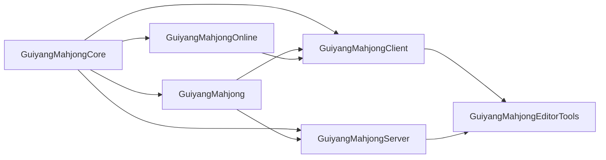

# 贵阳麻将游戏解决方案项目结构与目录结构审查报告

审查日期：2026-07-29  
审查根目录：`H:\MahjongGame`  
审查基线：Git `d9ebb12`（`main`，工作树干净）  
审查方式：目录盘点、构建入口与依赖静态分析、生成物与大文件检查、CI/部署/文档组织审查  
审查边界：本报告不执行目录移动、不修改业务代码，也不替代运行时性能、安全渗透或生产容灾验证。

## 1. 结论摘要

项目已经不是早期单体 UE 工程，而是由以下部分组成的完整游戏解决方案：

- Unreal Engine 5.8 Windows/Android 客户端；
- Unreal Dedicated Server；
- Auth、Lobby、Allocator、PlayerData、Admin 五个 .NET 10 服务；
- Angular 22 管理端；
- PostgreSQL、Redis、OpenTelemetry、Prometheus、Loki、Tempo、Grafana；
- Docker Compose、Kubernetes、Agones 与 Linux/WSL 部署链；
- 美术源资产、UE Cooked 资产、自动化脚本、OpenAPI 和监控治理契约。

总体架构方向正确，UE 模块与 Client/Server Target 隔离清晰，后端服务没有形成直接的生产程序集环依赖，测试和部署能力较完整。当前最需要优化的不是重新设计业务架构，而是统一仓库治理：

1. 清理被版本控制的编译、发布和 Python 缓存产物；
2. 重新组织 85 个根级脚本，消除本机绝对路径；
3. 合并 `Docs` 与 `claudedocs` 的文档入口，标记历史文档；
4. 拆分 700～1600 行的入口、流程和测试文件；
5. 用独立契约项目或生成代码替代测试项目对其他服务生产程序集的别名引用；
6. 统一 .NET 版本、包版本、代码风格和所有权配置；
7. 将多个部署变体改造成明确的 base/overlay 或环境分层。

结构成熟度评估为 **7/10**。运行边界成熟度高于仓库可维护性；如果不先处理仓库治理，后续多人并行开发会逐渐被脚本、文档和生成物冲突拖慢。

## 2. 当前解决方案结构

```text
H:\MahjongGame
├─ GuiyangMahjong.uproject       # UE 工程入口
├─ Source/                       # UE C++ 模块与 Client/Server/Editor Target
├─ Content/                      # UE 可发布资产
├─ SourceArt/                    # Blender、贴图、音频等美术源文件
├─ Plugins/Agones/               # 项目级 Agones UE 插件
├─ Config/                       # UE 通用与平台配置
├─ Services/                     # .NET 服务、测试和 Angular Admin
├─ Contracts/                    # OpenAPI、监控、SLO 和治理契约
├─ Deploy/                       # Compose、Kubernetes、Agones、可观测性和数据库权限
├─ Scripts/                      # 构建、部署、测试、美术生成/导入/验证脚本
├─ Docs/                         # 架构、设计、运行手册和阶段文档
├─ claudedocs/                   # 工作流、研究和阶段执行状态
├─ Artifacts/                    # 构建产物与审查证据，当前职责混合
├─ .github/workflows/            # Unreal 与服务端 CI
└─ Binaries/Intermediate/...     # UE 本地生成目录
```

### 2.1 UE 模块



| 模块 | 当前职责 | 评价 |
|---|---|---|
| `GuiyangMahjongCore` | 牌、规则、牌桌引擎和共享 DTO | 边界合理；如继续追求纯规则层，可逐步减少对完整 `Engine` 的暴露 |
| `GuiyangMahjong` | 客户端与服务端共享的游戏框架桥接 | 合理，Client/Server 均可依赖 |
| `GuiyangMahjongOnline` | 登录、鉴权和在线会话 | 独立 ClientOnly 模块，边界清楚 |
| `GuiyangMahjongClient` | UI、输入、表现、音频和远程大厅接入 | 与服务端隔离良好 |
| `GuiyangMahjongServer` | 房间权威状态、Dedicated Server 生命周期和 Agones | ServerOnly，隔离良好 |
| `GuiyangMahjongEditorTools` | 资源生成、验证和自动化测试 | Editor-only，未污染 Shipping Target |

`GuiyangMahjongClient.Target.cs` 不包含 Server 模块，`GuiyangMahjongServer.Target.cs` 不包含 Client/Online 模块，并已有模块图和包隔离门禁。这是当前目录设计中最成熟的部分。

### 2.2 后端服务

```text
Services/
├─ GuiyangMahjong.Auth/
├─ GuiyangMahjong.Lobby/
├─ GuiyangMahjong.Allocator/
├─ GuiyangMahjong.PlayerData/
├─ GuiyangMahjong.Admin/
│  ├─ ClientApp/                # Angular 22 源码
│  └─ wwwroot/                  # Angular 构建结果
├─ GuiyangMahjong.Observability/
├─ GuiyangMahjong.*.Tests/
├─ GuiyangMahjong.Services.slnx
└─ global.json
```

生产服务仅共同引用 `GuiyangMahjong.Observability`，没有 Auth/Lobby/Admin 之间的生产项目引用，服务运行边界是健康的。每个主要服务具备自己的 Domain、Options、Services、Storage 或 Api 层，但 Admin 和 Lobby 已经明显超过“按技术层分目录”能够舒适承载的规模。

## 3. 做得较好的部分

### 3.1 Client、Server、Editor 目标隔离明确

- `.uproject` 使用 ClientOnly、ServerOnly、Editor 类型；
- Agones 仅允许 Server/Editor；
- Client 和 Server Target 分别声明模块集合；
- CI 同时构建 Win64 Client、Win64 Server 和 Linux Server；
- 已提供 `Test-TargetModuleGraph.ps1` 与 `Test-PackageIsolation.ps1`。

建议保持现有 UE 模块名称和 `Source/` 根结构，不要为了目录“整齐”做无收益的大规模模块改名。

### 3.2 服务边界与部署单元一致

Auth、Lobby、Allocator、PlayerData、Admin 都有独立项目、Dockerfile、配置和测试项目。共同可观测性通过单向项目引用复用，没有抽出包含业务逻辑的“万能 Common”项目。

### 3.3 源资产与 UE 资产基本分离

`SourceArt` 保存 Blender、GLB、PNG、WAV 和生成清单，`Content` 保存 UE `.uasset/.umap`。大部分二进制美术文件已经使用 Git LFS，避免直接撑大普通 Git 对象。

### 3.4 契约、部署与运维能力已形成专门目录

- `Contracts/OpenAPI` 保存 Auth/Lobby/Allocator API；
- `Contracts/Monitoring` 保存遥测、分页、调查、SLO 和演练契约；
- `Deploy/observability` 包含可观测性完整栈；
- `Deploy/postgres/least-privilege` 独立管理数据库权限；
- `Docs/RUNBOOKS` 已开始承载可执行运行手册。

## 4. 分级问题

本次没有发现要求立即停工的 P0 目录问题。以下 P1 会持续制造错误、冲突或交付歧义，应优先处理。

### P1-1：版本库提交了可再生构建产物和缓存

证据：

- `Artifacts/WorkflowC` 跟踪 80 个发布文件，包括 DLL、EXE、PDB、压缩静态文件和两套 Admin Publish；
- `Scripts/__pycache__` 跟踪 26 个 `.pyc`；
- `Services/GuiyangMahjong.Admin/wwwroot` 跟踪 Angular 哈希产物；
- Admin `.csproj` 和 Dockerfile 已经能够在 Publish/Image Build 时重新生成 Angular 产物；
- `Artifacts` 同时保存 CI 交付物、本地 Linux Server、TRX 和人工截图，职责混合。

影响：

- 二进制差异无法审查；
- Angular 每次构建都会造成无业务意义的哈希文件变更；
- Python 版本变化会制造 `.pyc` 冲突；
- 仓库历史包含本可从源码重建的发布包；
- “审查证据”和“部署产物”没有不同保留策略。

建议：

1. `.gitignore` 增加 `**/__pycache__/`、`*.py[cod]`；
2. 从版本控制移除现有 `.pyc`；
3. 将 `Artifacts/WorkflowC` 移到 CI Artifact、制品库或对象存储；
4. `wwwroot` 选择单一策略：
   - 推荐：不跟踪，CI/Docker/Publish 强制构建；
   - 如果离线交付必须跟踪，则只由发布流水线更新，并禁止开发者手工构建后提交；
5. 将人工审查截图迁移到 `Evidence/Reviews/<workflow>/<date>/`，只保留清单、缩略图或必要证据；
6. `Artifacts/` 仅用于本地/CI 可删除输出，并整体忽略，最多保留 `.gitkeep`。

### P1-2：脚本目录平铺、生命周期混杂且不可移植

证据：

- `Scripts` 根目录有 85 个文件，其中 55 个 Python、30 个 PowerShell；
- 同一目录混合 Build、Deploy、Test、Open、Import、Generate、Repair、Purge、Diagnose；
- 多个脚本默认写死 `H:\MahjongGame`、`F:\UnrealEngine-5.8.0-release`、`D:\UnrealEngine-5.8.0-release`、用户临时目录和 `F:/TT`；
- 仍有脚本引用当前不存在的 `SourceArt/3D/MahjongTable`、`MahjongTableReview`；
- 生产、一次性迁移、历史修复和日常开发入口无法从目录判断。

影响：

- 换机器、换盘符或 CI 执行容易失败；
- 高风险 Purge/Repair 脚本与只读 Validate/Open 脚本同级；
- 无法判断哪些脚本仍受支持；
- 资产流水线存在多套名称相近的旧版本。

建议结构：

```text
Scripts/
├─ build/             # UE Client/Server、.NET、Admin Web
├─ test/              # Unit、Integration、Contract、Visual
├─ deploy/            # Linux、WSL、Kubernetes
├─ diagnostics/       # 网络、资源、运行状态诊断
├─ launch/            # Editor、客户端和人工验证入口
├─ assets/
│  ├─ blender/
│  ├─ unreal-import/
│  ├─ ui/
│  └─ validation/
├─ migrations/        # 一次性、可追溯、带日期的变更脚本
├─ legacy/            # 已停用但暂时保留的历史脚本
├─ lib/               # ProjectRoot、EngineRoot、日志和安全检查公共函数
└─ README.md
```

所有脚本应从以下来源解析环境，不再内置个人路径：

1. 显式命令行参数；
2. `MAHJONG_PROJECT_ROOT`、`UE_ROOT` 等环境变量；
3. 根据脚本位置推导项目根；
4. 找不到时清晰失败。

涉及删除、替换资产的脚本必须先校验绝对路径位于任务目标目录，并输出 dry-run 清单。

### P1-3：文档存在两个入口，且“当前状态”互相矛盾

证据：

- `Docs` 有 51 个文件，`claudedocs` 有 20 个文件；
- 根目录没有 `README.md`、`Docs/README.md` 或统一文档索引；
- `Docs/EXISTING_PROJECT_AUDIT.md` 仍声明插件和 Scripts 不存在、项目没有 Git 仓库，与当前仓库明显冲突；
- `Docs/FULL_APPLICATION_ARCHITECTURE.md` 标记为当前架构，但部分模块职责已被后续 Client/Server 拆分改变；
- 阶段文档、研究文档、当前架构、审查证据和执行状态混在两个根目录。

影响：

- 新成员无法判断哪个文档有效；
- 自动化代理容易引用过期结论；
- 运维手册和历史交付记录缺少稳定链接；
- 同一功能可能出现多份“最终版”。

建议：

```text
Docs/
├─ README.md                   # 唯一文档目录
├─ architecture/              # 当前态架构和模块边界
├─ adr/                       # 架构决策记录
├─ development/               # 本地开发、构建、测试
├─ operations/                # 部署、SLO、Runbook
├─ assets/                    # 美术规范与导入流程
├─ reviews/                   # 审查报告与整改计划
└─ history/                   # 阶段报告、研究、已替代文档
```

将 `claudedocs` 逐步合并到 `Docs/history` 或 `Docs/reviews`。所有历史文档头部增加：

- 状态：Current / Superseded / Historical；
- 最后核对日期；
- 替代文档；
- 责任人。

### P1-4：多个核心文件已成为“上帝文件”

代表性文件：

| 文件 | 约行数 | 主要问题 |
|---|---:|---|
| `MahjongCoreTests.cpp` | 1600+ | 规则、房间、UI、安全、资产测试全部集中 |
| `AdminEndpoints.cs` | 1259 | 房间、玩家、审批、案件、证据和审计入口集中 |
| `LobbyService.cs` | 1159 | 房间、玩家、生命周期、分配和结算编排集中 |
| `PostgresAuthStore.cs` | 911 | 多类身份持久化操作集中 |
| `PlayerEvidenceEndpoints.cs` | 876 | 多种证据类型、授权和导出集中 |
| `GuiyangMahjongGameMode.cpp` | 934 | 房间、对局、网络和生命周期集中 |
| `MahjongTableEngine.cpp` | 822 | 多种规则与状态转换集中 |
| `admin-console.ts` | 694 | 页面状态、API、SSE 和渲染集中 |

这些文件当前仍可测试，但继续增长会提高冲突率和审查成本。

建议：

- Admin/Lobby 从“技术层 + 巨型入口”过渡到轻量垂直切片；
- endpoint 文件只负责路由和 DTO 绑定，授权与用例进入独立 Handler；
- 存储按聚合拆分，而不是一个 Store 覆盖全部表；
- Angular 拆成 Room、Player、Governance、Observability feature，并抽出 typed API client；
- UE 测试按 `Core/Rules`、`Room`、`Server`、`Client/UI`、`Assets` 拆文件；
- `MahjongTableEngine` 只保留状态机协调，把胡牌判定、鸡牌、结算、动作优先级拆为无状态规则对象；
- 拆分期间保持类名、反射路径和 UE 资产引用稳定，避免不必要的 UObject 改名。

### P1-5：契约测试通过引用其他服务生产程序集耦合

证据：

- `Admin.Tests` 以 `Aliases="LobbyContract"` 引用 Lobby 项目；
- `Auth.Tests` 以 `Aliases="lobby"` 引用 Lobby 项目；
- 测试用 `extern alias` 比较跨服务 Wire DTO；
- `Contracts/OpenAPI` 只有 Auth、Lobby、Allocator，没有 Admin 和 PlayerData；
- 监控部分契约主要是 Markdown/YAML，尚不能全部生成强类型代码。

生产服务没有直接耦合，这是优点；但测试层已经暴露出契约没有独立归属的问题。

建议：

1. 建立 `Contracts/schemas`，把 HTTP、事件和 Dedicated Server 遥测定义为 OpenAPI/JSON Schema/AsyncAPI；
2. CI 从契约生成 C# DTO/客户端或做序列化黄金样本测试；
3. 如短期必须共享 C# 类型，创建只含 immutable wire DTO 的 `GuiyangMahjong.Contracts`，禁止引用 ASP.NET、数据库或业务服务；
4. 补充 Admin、PlayerData OpenAPI；
5. 契约版本与服务实现分离，避免为验证字段兼容而编译整个对方服务。

## 5. P2 优化项

### P2-1：缺少根级工程入口和统一开发规范

当前缺少：

- 根 `README.md`；
- `.editorconfig`；
- `.github/CODEOWNERS`；
- `Directory.Build.props`；
- `Directory.Packages.props`；
- 根级工具版本说明。

`Services/global.json` 已固定 .NET SDK，但项目包版本仍逐项目重复。建议保留 `Services/global.json` 或提升到根级，并在 Services 内增加集中包管理和统一的 Nullable、WarningsAsErrors、分析器设置。

### P2-2：解决方案清单不完整

`GuiyangMahjong.Services.slnx` 没有显式列出 `GuiyangMahjong.Observability`。它会作为 ProjectReference 间接构建，但 IDE、依赖图和独立测试发现不完整。应显式加入解决方案。

`GuiyangMahjong.FakeGameServer` 只剩 `bin/obj`，没有源码或 csproj，属于本地孤儿目录：

- 如果仍需要：恢复到 `Services/TestDoubles/GuiyangMahjong.FakeGameServer` 并纳入解决方案；
- 如果已废弃：删除本地生成目录，并由测试 fixture 或容器替代。

### P2-3：部署目录同时承载当前、兼容和实验配置

当前存在：

- `Deploy/docker-compose.yml`；
- `Deploy/linux/compose.yaml`；
- `Deploy/capacity/compose.yaml`；
- `Deploy/observability/compose.yaml`；
- Kubernetes 本地依赖、Linux/Windows Allocator 和生产示例；
- Agones 独立清单。

`Deploy/README.md` 已说明部分文件只是历史兼容，但目录没有显式表达生命周期。

建议：

```text
Deploy/
├─ compose/
│  ├─ base/
│  └─ overlays/{local,capacity,observability,production}/
├─ kubernetes/
│  ├─ base/
│  └─ overlays/{dev,staging,prod}/
├─ agones/
├─ database/
├─ legacy/
└─ README.md
```

可以使用 Compose 多文件合并与 Kustomize/Helm 避免复制整份服务定义。Secret 示例只能保留键名和占位符，生产值继续来自外部密钥系统。

### P2-4：Admin 前端源码和生成结果采用双重真实来源

`ClientApp` 是可重建源码，`wwwroot` 是构建结果；两者都被跟踪。Admin `.csproj` 已明确“发布前生成”，Dockerfile也有独立 Node build stage，因此推荐以 `ClientApp` 为唯一真实来源。

如果为了直接 `dotnet run` 必须提供静态文件，可增加显式 `npm run build:local` 或 Development proxy，不必长期提交哈希 bundle。

### P2-5：资产流水线有清单，但缺少统一资产治理入口

优点是麻将桌和 UI 已有部分 manifest。仍建议增加：

- `SourceArt/README.md`：源文件、许可证、单位、坐标系、色彩空间和命名；
- 每个资产族统一 `manifest.json`；
- 源文件、导出中间文件和最终导入文件分层；
- CI 检查 Content 中资产是否有来源、许可证和导入脚本；
- 过时资产管线移动到 `Scripts/legacy`。

特别说明：UE `Content` 的移动必须通过 Unreal Editor 完成并 Fix Up Redirectors，不能直接用文件系统批量移动 `.uasset/.umap`。

## 6. 推荐目标目录

目标结构不要求一次完成，可保持 Unreal 的标准 `Source/Content/Config/Plugins` 不变，重点优化外围工程：

```text
H:\MahjongGame
├─ README.md
├─ AGENTS.md
├─ GuiyangMahjong.uproject
├─ Source/
├─ Content/
├─ Config/
├─ Plugins/
├─ SourceArt/
│  ├─ 3D/<AssetFamily>/{Source,Textures,Exports,Previews,manifest.json}
│  ├─ UI/<AssetFamily>/
│  └─ README.md
├─ Services/
│  ├─ global.json
│  ├─ Directory.Build.props
│  ├─ Directory.Packages.props
│  ├─ GuiyangMahjong.Services.slnx
│  ├─ BuildingBlocks/Observability/
│  ├─ Auth/
│  ├─ Lobby/
│  ├─ Allocator/
│  ├─ PlayerData/
│  ├─ Admin/
│  ├─ Web/AdminConsole/
│  └─ Tests/{Unit,Integration,Contract,TestDoubles}/
├─ Contracts/
│  ├─ openapi/
│  ├─ events/
│  ├─ telemetry/
│  └─ generated/
├─ Deploy/
│  ├─ compose/{base,overlays}/
│  ├─ kubernetes/{base,overlays}/
│  ├─ agones/
│  ├─ database/
│  └─ legacy/
├─ Scripts/
│  ├─ build/
│  ├─ test/
│  ├─ deploy/
│  ├─ launch/
│  ├─ diagnostics/
│  ├─ assets/{blender,unreal-import,ui,validation}/
│  ├─ migrations/
│  ├─ legacy/
│  └─ lib/
├─ Docs/
│  ├─ README.md
│  ├─ architecture/
│  ├─ adr/
│  ├─ development/
│  ├─ operations/
│  ├─ assets/
│  ├─ reviews/
│  └─ history/
├─ Evidence/                    # 必须入库的轻量人工审查证据
└─ Artifacts/                   # 完全可删除、默认忽略的本地/CI 输出
```

说明：将现有 `Services/GuiyangMahjong.*` 立即改成短目录名会影响 Dockerfile、Compose、CI 和大量脚本。建议先完成治理文件与内部拆分，再评估是否值得移动服务根目录。

## 7. 分阶段执行计划

### 阶段 0：仓库卫生与真实来源，1～2 人日

- 忽略并移除已跟踪的 `__pycache__/*.pyc`；
- 移除 `Artifacts/WorkflowC` 发布二进制；
- 明确 `wwwroot` 是否跟踪，推荐改为构建生成；
- 新增根 README、Docs 索引、Scripts README；
- 给过期文档增加 Historical/Superseded 标识；
- 清理或恢复 `GuiyangMahjong.FakeGameServer`。

验收：

- 全新 clone 后不依赖仓库内 publish DLL；
- 运行测试/Angular/Python 不产生待提交生成文件；
- 新成员 10 分钟内能找到构建、测试、启动和部署入口。

### 阶段 1：工具链与目录治理，3～5 人日

- 对 Scripts 分类，先移动仍活跃入口；
- 抽取 ProjectRoot、UE_ROOT 和日志公共函数；
- 消除 `H:\`、`F:\`、`D:\` 和用户临时目录默认值；
- 将 legacy Compose/脚本移入明确目录；
- 增加 `.editorconfig`、CODEOWNERS、Directory.Build.props、Directory.Packages.props；
- 把 Observability 显式加入 slnx。

验收：

- Windows 开发机和 CI 使用相同参数入口；
- 危险脚本与日常脚本物理分离；
- 所有服务共享同一版本与编译策略来源。

### 阶段 2：契约与代码拆分，1～2 个迭代

- 补齐 Admin/PlayerData OpenAPI；
- 建立独立 Wire Contract/生成客户端；
- 删除测试项目对其他生产服务程序集的别名引用；
- 按 feature 拆分 Admin/Lobby Endpoint、Workflow 和 Store；
- 拆分 Angular console 与 UE 巨型测试文件；
- 为目录和依赖方向增加架构测试。

验收：

- 修改 Lobby 内部实现不要求 Admin/Auth 测试编译 Lobby 生产程序集；
- 单个 endpoint/handler 文件建议控制在 300～500 行；
- 新功能可以在一个 feature 目录内定位 API、授权、用例和测试。

### 阶段 3：部署与资产治理，1 个迭代

- Compose/Kubernetes 改为 base + overlay；
- 建立资产族 manifest 和许可证检查；
- 将审查证据与可重建发布产物分开；
- 增加脚本、文档和资产所有权规则。

## 8. 建议的目录治理规则

1. `Source/Content/Config/Plugins` 遵循 Unreal 约定，不因通用后端习惯随意改名。
2. 生产源码、源资产、契约、部署声明、文档、证据、生成物各自只有一个根目录。
3. 可从源码稳定重建的文件默认不入库。
4. 当前态文档只能有一个入口；历史文档不得继续自称“当前”。
5. 服务之间通过网络契约协作，不通过引用对方生产程序集共享领域模型。
6. `BuildingBlocks` 只允许横切基础设施，不允许放 Auth、Room、Player 等业务类型。
7. 所有脚本必须可从任意工作目录执行，并显式解析项目根。
8. 高风险资产删除和部署脚本必须支持 dry-run、精确目标和失败回滚。
9. UE 资产移动只在 Editor 内进行；美术源文件移动必须同步 manifest 和导入脚本。
10. 每个顶层目录必须有 README，说明责任、所有者、生成策略和禁止事项。

## 9. 最终建议

不建议立即对整个仓库做“大搬家”。最合适的顺序是：

1. 先清生成物、缓存和过期文档；
2. 再建立 README、索引、所有权和统一工具链；
3. 然后按活跃度迁移脚本并拆分超大文件；
4. 最后处理服务目录重命名、部署 overlay 和资产目录细化。

这样可以先消除日常冲突和误导，同时避免同时改动 Unreal 资产引用、Docker Context、CI、部署路径和大量脚本造成高风险合并。
