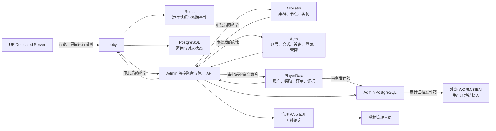
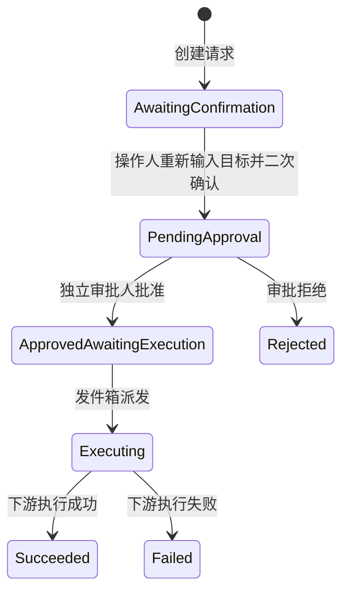

# 服务器、房间与玩家实时监控管理应用审查报告

> 审查日期：2026-07-28  
> 审查范围：`GuiyangMahjong.Admin`、`Lobby`、`Allocator`、`Auth`、`PlayerData`、Dedicated Server 遥测、部署脚本及相关测试  
> 审查方式：静态代码审查、配置与数据结构核对；运行状态引用 2026-07-27 本地联调结果  
> 结论等级：**有条件通过，适合本地联调和预生产验证；完成本报告 P1 项目前不建议无条件生产上线**

## 1. 执行摘要

项目已经形成了独立的服务器、房间和玩家监控管理应用，主链路完整：

- Dedicated Server 定时向 Lobby 上报房间运行遥测；
- Lobby 汇总房间、玩家在线状态、事件时间线；
- Allocator 提供集群、节点和 Dedicated Server 实例信息；
- Auth 提供玩家身份、登录、设备、会话和账号管控信息；
- PlayerData 提供资产、奖励、订单和回放等证据投影；
- Admin 作为监控聚合层和管理入口，提供只读监控、敏感证据查询、双人审批、命令执行、审计与案件管理；
- Web 管理台当前采用 5 秒轮询刷新。

权限、二次确认、职责分离、状态并发校验、事务发件箱和防篡改审计设计较完整，并且没有提供直接修改对局结果的管理命令。整体安全控制强于一般内部运营工具。

当前主要差距不在“有没有页面和接口”，而在生产级可观测性和历史证据完整性：

1. CPU、网络流量、托管及掉线时刻等字段已建模，但 Dedicated Server 尚未完整上报；
2. 内存上报值疑似是系统已用物理内存，不是 Dedicated Server 进程常驻内存；
3. 缺少标准指标、集中日志、分布式追踪、告警和时序存储体系；
4. 聚合查询是全有或全无，一个下游故障可能使整个总览失败；
5. 部分“实时”能力依赖全量轮询，房间和玩家数量增长后会遇到容量瓶颈；
6. 房间事件、玩家房间史、掉线史还不是长期、不可抵赖的证据存储；
7. 回放、房间日志、聊天记录目前分别只达到元数据、快照导出或权限查询层面；
8. 数据库最小权限主要依靠应用和触发器，尚未看到生产部署使用独立数据库角色进行强制隔离。

## 2. 实现架构



### 2.1 服务器与房间监控链路

1. UE Dedicated Server 从权威 `PlayerController` 收集在线玩家、座位、延迟、生命周期、当前局、开局时间、Tick、FPS、累计 RPC 和内存数据。
2. Dedicated Server 通过心跳接口发送到 Lobby。
3. Lobby 将运行快照写入 Redis，将生命周期变化、玩家连接变化和管理操作写入房间事件流。
4. Admin 同时读取 Lobby 房间信息和 Allocator 实例信息，以实例 ID 关联集群、节点、端口、PID 和进程状态。
5. 管理台展示总览、房间列表、服务器列表和房间详情。

### 2.2 玩家监控链路

1. Auth 保存玩家基本资料、登录事件、设备指纹、会话、冻结/封禁/禁言和 GM 管控记录。
2. Lobby 提供玩家所在大厅、房间、游戏服务器和当前在线状态。
3. Admin 从房间运行遥测补充玩家延迟、连接状态和掉线信息。
4. PlayerData 通过事务发件箱把举报、资产变化、奖励、支付订单和回放元数据投影到 Admin。
5. Admin 聚合以上数据，形成玩家列表、玩家详情和受控证据查询。

### 2.3 管理操作与审计链路

管理操作状态机如下：



每个动作要求操作原因、关联工单和 TraceId；在确认和审批时重新校验目标状态序列或状态哈希，避免基于过期页面执行操作。操作人不能审批自己的请求。命令通过事务发件箱派发，关键审计记录写入哈希链账本，并由数据库触发器禁止更新、删除和截断。

## 3. 目录结构

```text
H:\MahjongGame
├─ Services
│  ├─ GuiyangMahjong.Admin
│  │  ├─ Api
│  │  │  ├─ AdminEndpoints.cs              # 总览、房间、玩家、操作、审批、案件接口
│  │  │  └─ PlayerEvidenceEndpoints.cs     # 受控证据查询与资产操作接口
│  │  ├─ Domain
│  │  │  ├─ MonitoringModels.cs            # 房间、实例、遥测、玩家聚合模型
│  │  │  ├─ ManagementModels.cs            # 管理动作、审批、审计、命令模型
│  │  │  ├─ PlayerEvidenceModels.cs        # 举报、支付、回放等证据模型
│  │  │  ├─ PlayerAssetOperationModels.cs  # 补偿和撤销奖励模型
│  │  │  └─ CaseModels.cs                  # 调查/客服案件模型
│  │  ├─ Security
│  │  │  ├─ AdminAuthenticationMiddleware.cs
│  │  │  └─ AdminPrincipal.cs              # RBAC 角色定义
│  │  ├─ Services
│  │  │  ├─ MonitoringAggregationService.cs
│  │  │  ├─ MonitoringClients.cs
│  │  │  ├─ PlayerMonitoringServices.cs
│  │  │  ├─ AdminActionWorkflow.cs
│  │  │  ├─ AdminCommandDispatcher.cs
│  │  │  ├─ HttpAdminCommandExecutor.cs
│  │  │  └─ AuditArchiveDispatcher.cs
│  │  ├─ Storage
│  │  │  ├─ schema.sql                     # 操作、审批、审计、案件、证据、发件箱
│  │  │  └─ Postgres*.cs                   # PostgreSQL 持久化实现
│  │  └─ wwwroot
│  │     ├─ index.html
│  │     ├─ app.js                         # 管理台交互与 5 秒刷新
│  │     └─ styles.css
│  ├─ GuiyangMahjong.Lobby
│  │  ├─ Api/LobbyEndpoints.cs             # 遥测、事件、玩家位置、房间控制
│  │  └─ Storage/RoomMonitoringStore.cs    # Redis 快照和事件时间线
│  ├─ GuiyangMahjong.Allocator             # 集群、节点、实例和进程生命周期
│  ├─ GuiyangMahjong.Auth                  # 玩家、会话、登录、设备、账号管控
│  └─ GuiyangMahjong.PlayerData
│     ├─ Api/PlayerDataEndpoints.cs
│     ├─ Domain/PlayerDataModels.cs
│     ├─ Services/PlayerDataServices.cs
│     └─ Storage
│        ├─ PostgresPlayerDataStore.cs
│        └─ schema.sql                     # 钱包、奖励、交易、证据和发件箱
├─ Source
│  └─ GuiyangMahjongServer
│     └─ Private/Server/GuiyangGameServerBridge.cpp
│                                            # UE Dedicated Server 遥测生产者
├─ Deploy
│  ├─ linux/compose.yaml                    # 本地一键服务编排
│  └─ kubernetes
│     ├─ admin.yaml
│     └─ player-data.yaml
├─ Scripts
│  └─ Start-AllServices.ps1                 # 一键启动基础设施和业务服务
└─ Docs
   ├─ PLAYER_MONITORING_ADMIN_DESIGN.md
   └─ REALTIME_SERVER_PLAYER_MONITORING_REVIEW_20260728.md
```

## 4. 功能完成度审查

状态定义：

- **完成**：已有数据来源、接口、聚合模型和管理台展示；
- **部分完成**：模型或入口存在，但数据来源、持久化、展示或生产集成不完整；
- **未完成**：未发现可用实现。

### 4.1 房间与服务器监控

| 需求 | 状态 | 审查说明 |
|---|---|---|
| 当前运行房间总数 | 完成 | Admin 聚合 Lobby 房间并计算总数、活跃数、异常数 |
| 不同玩法房间数量 | 完成 | 按规则快照中的 `gameMode` 分组 |
| 不同状态房间数量 | 完成 | 按房间生命周期分组 |
| 房间所在集群、节点 | 完成 | 通过 Allocator 实例与房间路由关联 |
| Dedicated Server 实例 | 完成 | 显示实例、端口、PID、启动、注册和心跳状态 |
| 房间创建时间、游戏开始时间 | 完成 | 房间快照和运行遥测均有对应字段 |
| 当前局数 | 完成 | Dedicated Server 上报 `roundId` |
| 房间规则、参与玩家 | 完成 | 来自 Lobby 房间快照 |
| 玩家连接状态、延迟 | 完成 | 来自权威玩家控制器遥测 |
| 掉线情况 | 部分完成 | 有连接变化事件；长期掉线历史和精确掉线时刻不完整 |
| 托管状态 | 部分完成 | 模型支持，当前 Dedicated Server 上报链路未完整填充 |
| 服务器 CPU | 部分完成 | 模型支持，当前心跳未见实际采集与发送 |
| 服务器内存 | 部分完成 | 已上报，但当前使用值可能是系统已用物理内存而非进程 RSS |
| 网络流量 | 部分完成 | 模型支持，当前心跳未见实际采集与发送 |
| Tick 时间 | 完成 | Dedicated Server 心跳上报 |
| FPS/服务器帧时间 | 完成 | 当前上报 FPS 和 Tick 毫秒 |
| RPC 数量 | 部分完成 | 有累计总数，缺少速率、RPC 方法、失败率和分位数 |
| 异常日志 | 部分完成 | 有失败原因和事件流，未接入集中日志搜索 |
| 房间事件时间线 | 完成（短期） | Redis 最多 500 条，保留 7 天 |
| 结算状态 | 部分完成 | 有 `Settling` 生命周期和结果接口，详情缺少显式结算确认状态 |

### 4.2 玩家监控

| 需求 | 状态 | 审查说明 |
|---|---|---|
| 玩家基本资料、账号状态 | 完成 | Auth 玩家目录提供 |
| 当前在线状态 | 完成 | 会话与 Lobby presence 聚合 |
| 当前设备 | 完成 | 使用不可逆设备指纹，不保存原始安装 ID |
| 当前 IP | 完成 | 默认仅返回脱敏 IP |
| 当前大厅 | 部分完成 | 字段存在，但 Lobby 标识目前主要为固定 `primary` |
| 当前房间、游戏服务器 | 完成 | Lobby presence 与房间路由关联 |
| 当前延迟 | 完成 | 从房间运行遥测补充 |
| 登录历史、设备历史 | 完成 | Auth 持久化和派生 |
| 房间历史、掉线历史 | 部分完成 | 从当前房间和有限事件反推，不是长期权威历史库 |
| 举报历史 | 完成 | PlayerData 证据投影到 Admin |
| 风险标签 | 完成 | 支持查询和授权标记 |
| 资产变化、奖励领取 | 完成 | PlayerData 权威账本和证据投影 |
| 支付订单 | 完成 | 支付证据模型和受控查询已实现 |
| 聊天记录权限查询 | 完成 | 只返回查询授权，不返回聊天内容 |
| 聊天内容合规检索 | 未完成 | 需要独立聊天归档与合规查询服务 |
| 封禁记录、GM 操作记录 | 完成 | Auth 控制历史和 Admin 审计账本 |
| 回放查看 | 部分完成 | 已有回放元数据，缺少对象存储签名地址和播放器 |

### 4.3 授权管理操作

下列操作类型已建模并接入统一审批工作流：

- 房间：查看详情、强制解散、终止异常服务器、标记异常、触发补偿、禁止新玩家加入、维护模式、导出房间日志、查看回放、发起争议调查；
- 玩家：强制下线、临时冻结、永久封禁、解除封禁、禁言、解除禁言、重置异常会话、标记风险账号、发放补偿、撤销错误奖励、查看回放、创建客服工单；
- 证据：查看身份历史、GM 操作、举报、资产、奖励、支付、回放元数据和聊天查询授权。

“导出房间日志”当前更接近房间状态和时间线 JSON 证据包，并非集中日志平台的原始服务日志导出。“查看回放”目前主要提供元数据，尚未形成端到端播放体验。

未发现修改牌局结果或直接改写结算结果的普通运营命令。补偿和撤销奖励走独立资产交易，要求案件、独立审批人和幂等键，符合“普通运营人员不得直接修改对局结果”的约束。

## 5. 安全、权限与审计审查

### 5.1 已实现的控制

- RBAC 细分为房间查看/操作/审批、玩家查看/操作/审批、处罚、风险、客服、基础设施、补偿、聊天合规和审计查看等角色；
- 支持企业 OIDC/JWT 身份，配置可强制 MFA；
- 本地 Bearer 身份仅适合开发和受控测试；
- 敏感证据查询要求角色、工单/案件和用途，并产生审计；
- IP 默认脱敏，设备 ID 使用 HMAC 派生，访问令牌不进入监控返回；
- 所有变更操作要求原因、工单、TraceId 和目标二次输入；
- 独立审批人机制阻止自批；
- 执行前使用状态序列/哈希阻止陈旧操作；
- 命令采用事务发件箱，支持幂等和失败重试；
- 审计账本采用前后哈希链，并由数据库触发器禁止修改、删除和截断；
- 审计归档支持发往外部 WORM/SIEM，但本地环境默认不启用；
- 资产补偿与撤销要求请求人和审批人分离，余额约束在数据库层校验。

### 5.2 仍需加强的控制

- 生产部署应为 Admin 审计写入、业务读写、迁移程序分别创建数据库角色；当前编排主要复用同一个 PostgreSQL 账号；
- WORM 归档、企业身份和管理命令执行必须设置生产启动门禁，不能只依赖人工配置；
- 管理台应配置 HTTPS、严格 CSP、短期令牌和读/导出速率限制；
- 对大批量导出、敏感证据读取和高危动作建立审批超时、撤销窗口与异常频率告警；
- 将审计链定期锚定到外部不可变存储，防止数据库管理员级别的整体重建攻击。

## 6. 关键发现与风险分级

### P1：生产上线前应完成

| 编号 | 发现 | 影响 | 建议 |
|---|---|---|---|
| P1-01 | CPU、网络、托管、精确掉线字段上报不完整；内存口径可能不准确 | 页面显示空值或误导数据，无法正确定位资源异常 | 使用进程级 CPU、RSS、网卡字节计数；补齐托管和掉线时刻，并为所有指标标注单位与采样周期 |
| P1-02 | 没有发现 OpenTelemetry、Prometheus、集中日志、追踪和告警体系 | 只能“看当前页面”，不能主动发现、关联和复盘生产故障 | 接入 OTel SDK/Collector、Prometheus、Grafana、Loki/OpenSearch、Tempo/Jaeger 和告警路由 |
| P1-03 | Admin 聚合大量使用 `Task.WhenAll`，下游任一失败可能导致总览整体失败 | 单点故障放大为监控黑屏 | 返回分源状态和数据新鲜度；实现超时、熔断、最后成功快照和部分成功响应 |
| P1-04 | 数据库最小权限未见部署级强制隔离 | 应用凭据泄露时，触发器之外仍有较大数据库权限面 | 使用独立数据库角色、Schema 权限、迁移账号和只写审计账号；在 CI 中验证权限 |
| P1-05 | 异常日志未进入可检索、可关联的集中日志系统 | “异常日志”需求只部分完成，争议调查证据不足 | 所有服务输出结构化日志，统一包含 RoomId、PlayerId、ServerInstanceId、MatchId、TraceId |

### P2：预生产阶段建议完成

| 编号 | 发现 | 影响 | 建议 |
|---|---|---|---|
| P2-01 | 管理台每 5 秒全量轮询；玩家上限 2000、房间上限 5000 | 数据量增加后延迟、带宽和下游压力快速增长 | 列表使用游标分页；变化通过 SSE/WebSocket 推送；详情按需拉取 |
| P2-02 | 房间运行快照保留 6 小时，事件最多 500 条且保留 7 天 | 长期争议、运营分析和容量趋势无法完整复现 | 将事件写入持久事件库，指标写入时序库，并按合规要求分层保留 |
| P2-03 | 玩家房间史和掉线史从有限房间/事件反推 | 历史不权威，较早记录会丢失 | 建立 append-only `player_room_history` 和 `player_connection_history` |
| P2-04 | 回放、日志导出和聊天能力未形成端到端产品 | 管理员无法在同一系统完成调查闭环 | 接入回放对象存储与播放器、集中日志导出、合规聊天归档网关 |
| P2-05 | 缺少显式结算状态机和结算确认信息 | 不能区分计算中、已提交、已确认、补偿中和失败 | 建立独立结算投影，记录版本、结果哈希、确认时间、失败原因和补偿案件 |
| P2-06 | Lobby 标识固定，Lobby 数据源也偏单一 | 多大厅、多地域场景定位不准确 | 服务注册时携带 Region/Cluster/Lobby/Node，Admin 动态发现多数据源 |

### P3：持续优化

| 编号 | 发现 | 建议 |
|---|---|---|
| P3-01 | 缺少每个数据源的最后更新时间和陈旧状态 | 在卡片和详情显示 `lastObservedAt`、数据年龄、来源健康状态 |
| P3-02 | RPC 只有累计总数 | 增加每秒速率、方法维度、拒绝/失败数及 P95/P99 耗时 |
| P3-03 | 前端令牌保存在会话存储 | 生产优先采用企业身份短会话、严格 CSP 和受控反向代理 |
| P3-04 | 缺少 SLO 和容量基线 | 定义监控可用性、数据新鲜度、命令完成时间和审计归档延迟 SLO |

## 7. 深化方案

### 阶段一：校准与可靠性（1～2 周）

1. 修正 Dedicated Server 进程 CPU、RSS 和网络采集口径；
2. 补齐托管、掉线时间、RPC 速率和结算状态上报；
3. 在 Admin 增加分源超时、降级、缓存和新鲜度显示；
4. 为房间和玩家列表增加服务端游标分页；
5. 落实 PostgreSQL 独立角色和最小权限；
6. 对以上指标增加自动化契约测试，禁止字段存在但长期不上报。

验收标准：

- 任一监控下游不可用时，其余数据仍能显示；
- 所有资源指标均可与操作系统工具交叉核对，误差在约定范围内；
- 监控页面能够明确显示数据来源、采样时间和陈旧状态；
- 应用运行账号无法更新或删除审计记录，也无法越权访问其他 Schema。

### 阶段二：生产可观测性（3～6 周）

1. 所有 .NET 服务和 UE Dedicated Server 接入统一 TraceId；
2. 部署 OTel Collector，指标进入 Prometheus，日志进入 Loki/OpenSearch，追踪进入 Tempo/Jaeger；
3. 建立房间数、心跳丢失、CPU、RSS、Tick、掉线率、RPC 风暴、命令积压、审计归档积压告警；
4. 房间/玩家关键事件进入持久事件存储；高频指标进入时序数据库；
5. 管理台采用“分页快照 + SSE/WebSocket 增量事件”；
6. 建立 Grafana 运行看板和告警处理手册。

建议首批 SLO：

- 监控 API 月可用性 ≥ 99.9%；
- 正常情况下遥测端到端新鲜度 P95 ≤ 10 秒；
- 高危命令从批准到开始执行 P95 ≤ 5 秒；
- 审计归档到 WORM P95 ≤ 60 秒；
- 房间心跳丢失在 30 秒内触发告警。

### 阶段三：调查闭环与治理（6～12 周）

1. 建立回放目录、对象存储、短期签名 URL 和 Web 播放器；
2. 建立合规聊天归档服务，按工单、时限和最小必要范围授权；
3. 房间日志、事件、回放、资产流水和聊天证据按 CaseId 自动形成证据包；
4. 把 RBAC 深化为 RBAC + ABAC，例如地域、班次、案件归属、金额阈值和数据级别；
5. WORM 与 SIEM 正式接入，并实施周期性审计链校验；
6. 进行故障演练、压力测试、跨集群容灾和管理命令灾难恢复演练。

## 8. 测试与运行核验

静态盘点共发现 102 个 `[Fact]`/`[Theory]` 测试方法，分布如下：

| 测试项目 | 测试方法数 |
|---|---:|
| GuiyangMahjong.Admin.Tests | 30 |
| GuiyangMahjong.Allocator.Tests | 20 |
| GuiyangMahjong.Auth.Tests | 11 |
| GuiyangMahjong.Lobby.Tests | 37 |
| GuiyangMahjong.PlayerData.Tests | 4 |

覆盖内容包括 API 权限、企业身份与 MFA、审批职责分离、状态并发、外部 PostgreSQL/Redis 持久化、幂等、发件箱并发和资产交易约束。

本次文档审查未重新编译或执行动态测试。2026-07-27 本地联调记录表明：

- PostgreSQL、Redis、Auth、Lobby、Allocator/Game Node、PlayerData、Admin 共 7 个容器健康；
- Admin 总览、房间和玩家认证查询成功；
- 5 个业务就绪端点返回成功；
- 本地管理命令执行、企业身份和 WORM 归档按安全默认值关闭。

上线前仍应新增：

- 遥测字段端到端契约测试；
- 下游超时和部分失败测试；
- 10 万玩家、1 万房间级分页和推送压力测试；
- 审计库权限逃逸测试；
- WORM、命令发件箱、事件库积压和灾难恢复测试；
- 管理台 XSS、CSP、越权、批量导出和敏感查询安全测试。

## 9. 查看方式

本地一键启动：

```powershell
powershell -ExecutionPolicy Bypass -File H:\MahjongGame\Scripts\Start-AllServices.ps1
```

启动完成后访问：

```text
http://127.0.0.1:18083
```

管理台主要入口：

- 总览：当前/活跃/异常房间、服务器实例、玩家和待处理命令；
- 房间：规则、路由、实例、运行指标、玩家连接和事件时间线；
- 玩家：脱敏身份、在线位置、延迟、登录/设备/房间/掉线/管控历史；
- 操作：发起管理动作、二次确认、独立审批和执行状态；
- 证据：案件、举报、资产、奖励、支付、回放元数据和聊天查询授权；
- 审计：操作人、时间、原因、前后状态、审批、TraceId 和工单。

## 10. 关键代码证据索引

- `Services/GuiyangMahjong.Admin/Domain/MonitoringModels.cs`：监控聚合模型；
- `Services/GuiyangMahjong.Admin/Services/MonitoringAggregationService.cs:107`：房间与实例并行聚合；
- `Services/GuiyangMahjong.Admin/Services/MonitoringClients.cs:35`：房间列表当前上限 5000；
- `Services/GuiyangMahjong.Admin/Services/PlayerMonitoringServices.cs:29`：玩家列表当前上限 2000；
- `Services/GuiyangMahjong.Admin/Services/PlayerMonitoringServices.cs:108`：玩家历史仅抽取最多 20 个房间；
- `Services/GuiyangMahjong.Admin/Domain/ManagementModels.cs:30`：管理状态机；
- `Services/GuiyangMahjong.Admin/Services/AdminActionWorkflow.cs:138`：二次确认与审批流程；
- `Services/GuiyangMahjong.Admin/Security/AdminAuthenticationMiddleware.cs:55`：MFA 校验；
- `Services/GuiyangMahjong.Admin/Storage/schema.sql:74`：阻止自批的数据库触发器；
- `Services/GuiyangMahjong.Admin/Storage/schema.sql:108`：阻止审计更新和删除；
- `Services/GuiyangMahjong.Lobby/Api/LobbyEndpoints.cs:316`：房间监控接口；
- `Services/GuiyangMahjong.Lobby/Storage/RoomMonitoringStore.cs:97`：运行快照保留 6 小时；
- `Services/GuiyangMahjong.Lobby/Storage/RoomMonitoringStore.cs:108`：房间事件保留 7 天；
- `Source/GuiyangMahjongServer/Private/Server/GuiyangGameServerBridge.cpp:354`：当前内存采集口径；
- `Services/GuiyangMahjong.Admin/wwwroot/app.js:430`：管理台 5 秒轮询；
- `Services/GuiyangMahjong.PlayerData/Storage/schema.sql`：钱包、奖励和交易约束；
- `Deploy/linux/compose.yaml`：本地服务编排和角色配置；
- `Scripts/Start-AllServices.ps1`：一键启动入口。

## 11. 最终审查意见

该应用已经完成监控与受控管理系统的核心骨架，房间、服务器、玩家、账号、资产、审批和审计能够形成基本闭环，适合作为预生产版本继续深化。权限和审计设计是当前实现的强项。

生产上线不应只以“页面能看到数据、按钮能执行”为验收标准。建议把 P1 项作为硬门禁，重点完成遥测口径、标准可观测平台、故障降级、集中日志和数据库权限隔离；随后通过持久事件库、实时推送、回放和合规聊天能力，补齐调查闭环。完成阶段一和阶段二后，系统才能从“实时管理后台”提升为具备生产事故发现、定位、处置和追责能力的运营控制平台。
