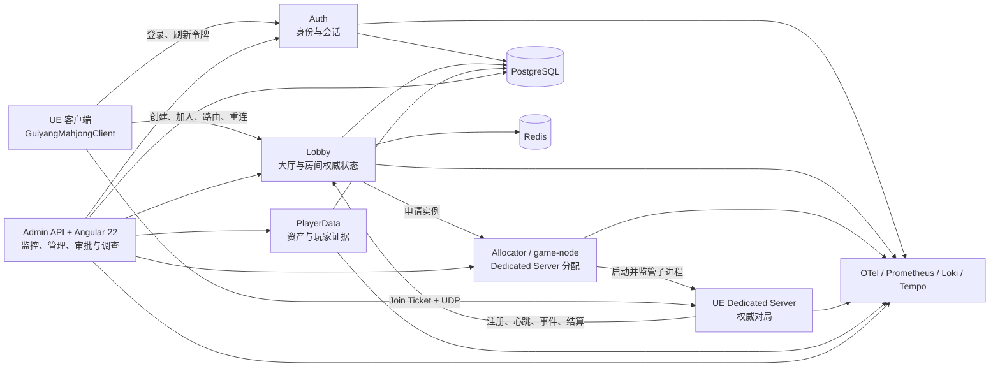

# 贵阳麻将解决方案项目架构及目录结构

> 文档状态：当前架构快照
> 基准日期：2026-07-31
> 工作区根目录：`H:\MahjongGame`
> 适用对象：客户端、Dedicated Server、后端、管理端、测试、运维与美术研发人员

## 1. 文档范围

本文档依据当前工作区中的项目清单、构建规则、源码目录、契约和部署清单生成，说明：

- 解决方案的技术组成和运行边界；
- Unreal Engine、.NET、Angular 三类工程的职责与依赖；
- 从登录、创建房间、分配 Dedicated Server 到对局监控的主链路；
- 根目录及主要二级、三级目录的用途；
- 源码、权威契约、可发布资产、构建输入、构建产物和运行产物之间的边界；
- 日常开发、构建、测试和部署的推荐入口。

本文档不记录本机密钥、`.env` 内容、数据库口令、访问令牌、临时日志或个人缓存。

## 2. 解决方案概览

当前仓库采用单仓多运行时架构：

| 层级 | 当前技术 | 主要入口 | 核心职责 |
| --- | --- | --- | --- |
| 游戏客户端 | Unreal Engine 5.8、C++、UMG | `GuiyangMahjongClient.Target.cs` | 登录、大厅、创建/加入房间、断线重连、麻将桌三维表现、移动端 UI |
| 游戏规则与共享运行时 | Unreal Engine C++ | `GuiyangMahjongCore`、`GuiyangMahjong` | 规则、牌桌状态、网络类型、共享 GameState/PlayerController |
| Dedicated Server | Unreal Engine 5.8 Server Target | `GuiyangMahjongServer.Target.cs` | 权威对局、房间生命周期、Join Ticket 校验、遥测和结算上报 |
| 控制面服务 | .NET 10、ASP.NET Core | `Services/GuiyangMahjong.Services.slnx` | 认证、大厅、分配器、玩家数据、管理聚合与审计 |
| 管理前端 | Angular 22、TypeScript 6 | `Services/GuiyangMahjong.Admin/ClientApp` | 服务器、房间、玩家、调查、审批和审计管理 |
| 数据层 | PostgreSQL 17、Redis 8 | `Deploy/linux/compose.yaml` | 权威持久化、状态索引、会话和热点数据 |
| 可观测性 | OpenTelemetry、Prometheus、Loki、Tempo、Grafana、Alertmanager | `Deploy/observability/compose.yaml` | 指标、日志、追踪、仪表板、告警和 SLO |
| 容器与编排 | Docker Compose、Kubernetes、Agones | `Deploy` | 本地一键部署、集群部署、游戏服分配与伸缩 |
| 美术资产管线 | Blender、UE Python、PowerShell | `SourceArt`、`Scripts`、`Content` | 可追溯源资产、全量导入、PBR 材质、验证与审查 |

## 3. 逻辑架构



### 3.1 创建房间主链路

1. 客户端调用 Auth 获取玩家访问令牌。
2. 客户端调用 Lobby 创建房间，Lobby 在 PostgreSQL 中保存权威房间快照，并在 Redis 中维护必要的热点状态。
3. Lobby 请求 Allocator 分配游戏服实例。
4. 本地 Compose 模式下，`game-node` 同时承载 .NET Allocator，并由 Allocator 启动 UE Dedicated Server 子进程；集群模式下可由 Agones Fleet/Allocator 承担实例分配。
5. Dedicated Server 注册并持续心跳，Lobby 返回 `ServerIp`、`ServerPort`、`JoinTicket` 和实例标识。
6. 客户端通过 Unreal UDP 网络连接 Dedicated Server；服务端校验玩家身份和 Join Ticket 后进入房间。
7. 房间事件、玩家连接状态、遥测和结算结果回流到控制面，供 Admin 聚合、调查和审计。

### 3.2 管理操作边界

- Admin 是管理入口和聚合层，不直接成为对局结果的任意写入口。
- 房间、玩家和基础设施操作必须经过 RBAC、二次确认、必要审批和审计记录。
- Auth、Lobby、Allocator、PlayerData 各自拥有独立管理命令令牌和最小数据库身份。
- PostgreSQL Schema 由独立迁移身份部署；生产运行身份不得执行 DDL。
- Angular 页面按数据源或面板独立降级，并显示数据来源、最后成功时间、数据年龄和陈旧阈值。

## 4. Unreal Engine 工程结构

### 4.1 Target 划分

| Target | 类型 | 加载模块 | 用途 |
| --- | --- | --- | --- |
| `GuiyangMahjong` | Game | `GuiyangMahjong`、`GuiyangMahjongOnline`、`GuiyangMahjongClient` | 常规非编辑器游戏构建 |
| `GuiyangMahjongClient` | Client | `GuiyangMahjong`、`GuiyangMahjongOnline`、`GuiyangMahjongClient` | 客户端专用发布，排除 Agones 和服务端生命周期代码 |
| `GuiyangMahjongServer` | Server | `GuiyangMahjong`、`GuiyangMahjongServer` | 无渲染 Dedicated Server，Shipping 保留必要网络和生命周期日志 |
| `GuiyangMahjongEditor` | Editor | 客户端、服务端和编辑器工具全部模块 | 资产制作、自动化、地图和人工审查 |

### 4.2 模块职责

| 模块 | 类型 | 主要职责 | 主要依赖方向 |
| --- | --- | --- | --- |
| `GuiyangMahjongCore` | Runtime | 麻将基础类型、规则、胡牌/吃碰杠/计分、牌墙和共享网络 DTO | 仅依赖 UE Core/Engine |
| `GuiyangMahjong` | Runtime | 客户端与服务端共享的游戏框架、GameState、PlayerState、PlayerController 和桥接接口 | 依赖 `GuiyangMahjongCore` |
| `GuiyangMahjongOnline` | ClientOnly | 登录、鉴权、本地登录状态和在线会话 | 依赖 Core、HTTP、JSON |
| `GuiyangMahjongClient` | ClientOnly | Lobby 后端、重连、客户端 GameMode、3D 麻将桌、镜头、历史、UMG UI、音频与设置 | 依赖 Core、Online、共享游戏模块 |
| `GuiyangMahjongServer` | ServerOnly | 权威 GameMode、房间管理、Join Ticket、Allocator/Lobby 回调、Agones 生命周期和遥测 | 依赖 Core、共享游戏模块、Agones、网络和 HTTP |
| `GuiyangMahjongEditorTools` | Editor | 资产生成、修复、检查、Commandlet 和编辑器自动化测试 | 可依赖全部运行时模块，但不进入客户端或服务端发布目标 |

依赖方向的核心约束是：规则核心不依赖 UI；客户端模块不得进入 Server Target；服务端模块不得进入 Client Target；编辑器工具不得进入运行时发布包。

## 5. .NET 与 Angular 工程结构

`Services/GuiyangMahjong.Services.slnx` 是后端统一解决方案入口，当前登记 6 个生产/共享项目和 6 个测试项目。

### 5.1 生产与共享项目

| 项目 | 职责 | 关键持久化/依赖 |
| --- | --- | --- |
| `GuiyangMahjong.Auth` | 游客登录、令牌刷新、登出、会话撤销、账号控制和玩家在线监控 | PostgreSQL、HMAC 令牌 |
| `GuiyangMahjong.Lobby` | 大厅引导、房间创建/加入/关闭、路由、重连、房间事件和玩家历史 | PostgreSQL、Redis、Allocator |
| `GuiyangMahjong.Allocator` | 端口分配、Dedicated Server 子进程管理、注册、心跳、排空和终止 | 本地状态文件或集群分配能力 |
| `GuiyangMahjong.PlayerData` | 奖励领取、资产变更、证据投影、聊天访问授权相关数据 | PostgreSQL |
| `GuiyangMahjong.Admin` | 监控聚合、SSE 推送、RBAC、双人审批、命令 Outbox、审计、调查、回放和日志导出 | PostgreSQL、其他控制面服务 |
| `GuiyangMahjong.Observability` | 结构化日志、TraceId/业务上下文、OpenTelemetry 指标和追踪公共能力 | OTLP |

Auth、Lobby、PlayerData、Admin 均通过 `Services/Directory.Build.targets` 将各自的 `Storage/schema.sql` 发布到独立路径：

```text
Schemas/Auth/schema.sql
Schemas/Lobby/schema.sql
Schemas/PlayerData/schema.sql
Schemas/Admin/schema.sql
```

该隔离规则防止多项目组合构建时同名 `schema.sql` 相互覆盖。

### 5.2 测试项目

| 项目 | 覆盖范围 |
| --- | --- |
| `GuiyangMahjong.Auth.Tests` | 登录、令牌、会话、账号控制与 API 行为 |
| `GuiyangMahjong.Lobby.Tests` | 房间、路由、重连、持久化、监控与容量行为 |
| `GuiyangMahjong.Allocator.Tests` | 分配、实例状态、端口与进程管理 |
| `GuiyangMahjong.PlayerData.Tests` | 资产、奖励、证据和投影 |
| `GuiyangMahjong.Admin.Tests` | 聚合、权限、审批、审计、调查与命令闭环 |
| `GuiyangMahjong.Architecture.Tests` | 项目依赖、目录治理、Schema 隔离和架构约束 |

### 5.3 Angular 管理端

Admin 前端唯一源码目录为 `Services/GuiyangMahjong.Admin/ClientApp`：

- Angular 22 standalone 应用；
- TypeScript 6；
- RxJS 7；
- `npm run typecheck` 执行静态类型检查；
- `npm run build` 生成生产包；
- 构建输出进入 `Services/GuiyangMahjong.Admin/wwwroot`，由 ASP.NET Core Admin 服务托管；
- `wwwroot` 是可重建产物，不是前端源码修改入口。

## 6. 根目录结构

```text
H:\MahjongGame
├─ .github/                  CI 工作流和 CODEOWNERS
├─ Artifacts/                可重建的构建、打包、发布和验证产物
├─ Binaries/                 Unreal 本机编译产物
├─ Build/                    Unreal 平台构建静态输入和 FileOpenOrder
├─ Config/                   Unreal 通用及平台配置
├─ Content/                  可发布 Unreal 资产
├─ Contracts/                跨进程和跨团队权威契约
├─ Deploy/                   Compose、Kubernetes、Agones、数据库和可观测性部署
├─ DerivedDataCache/         Unreal 派生数据缓存
├─ Docs/                     当前有效的核心架构、规范与运行手册
├─ Evidence/                 需长期保留并关联需求/工单的审查证据
├─ Intermediate/             Unreal 中间构建产物
├─ Plugins/                  项目级 Unreal 插件
├─ Saved/                    日志、Cook、Stage、截图和临时验证输出
├─ Scripts/                  构建、部署、测试、资产导入与验证入口
├─ Services/                 .NET 服务、测试及 Angular 管理前端
├─ Source/                   Unreal C++ 模块和 Target
├─ SourceArt/                Blender、纹理、音频等可追溯美术源文件
├─ AGENTS.md                 项目级资产、截图、注释和前端策略
├─ GuiyangMahjong.uproject   Unreal 工程入口
└─ README.md                 仓库总入口
```

### 6.1 源码与资产目录

```text
Source/
├─ GuiyangMahjongCore/
│  ├─ Public/{Auth,Core,Lobby,Network,Rules,Table}
│  └─ Private/{Auth,Core,Rules,Table}
├─ GuiyangMahjong/
│  ├─ Public/{Auth,Core,Editor,Game,Rules,Table}
│  └─ Private/{Auth,Core,Editor,Game,Rules,Table,Tests}
├─ GuiyangMahjongOnline/
│  └─ Public|Private/Auth
├─ GuiyangMahjongClient/
│  ├─ Public/{Game,History,Lobby,Network,Settings,UI}
│  └─ Private/{Game,History,Lobby,Network,Settings,UI}
├─ GuiyangMahjongServer/
│  ├─ Public/{Game,Room,Server}
│  └─ Private/{Game,Room,Server}
└─ GuiyangMahjongEditorTools/
   ├─ Public/Editor
   └─ Private/{Editor,Tests}

Content/
├─ Art/Mahjong/{Mahjong50,Table}
├─ Client/Room/Presentation
├─ Maps
├─ UI/{Audio,Components,Data,Dialogs,Materials,Screens,Textures}
└─ Python

SourceArt/
├─ 3D/{MahjongTableMobileProduction,MahjongTableProduction}
└─ UI/{Audio,Avatars,Backgrounds,Buttons,Controls,Data,Icons,Login,Panels,Tiles}
```

`SourceArt` 保存可追溯源文件，`Content` 保存进入 Unreal 发布链的资产。更新模型、纹理、材质等目标资产时，必须先精确删除本次范围内旧资源，再全量生成或导入，不能依赖覆盖导入保留旧状态。

### 6.2 后端目录

```text
Services/
├─ Directory.Build.props          .NET 10、分析器和公共编译基线
├─ Directory.Build.targets        Schema 隔离、复制和哈希校验
├─ Directory.Packages.props       NuGet 版本集中管理
├─ GuiyangMahjong.Services.slnx   后端统一解决方案
├─ Schema/                        共享 Schema 路径解析器
├─ GuiyangMahjong.Observability/  可观测性公共库
├─ GuiyangMahjong.Auth/
├─ GuiyangMahjong.Lobby/
├─ GuiyangMahjong.Allocator/
├─ GuiyangMahjong.PlayerData/
├─ GuiyangMahjong.Admin/
│  └─ ClientApp/                  Angular 22 源码
└─ GuiyangMahjong.*.Tests/        对应服务和架构测试
```

生产服务内部通常按以下职责拆分：

```text
Api/        HTTP 端点、请求响应映射和边界校验
Domain/     业务实体、值对象和状态模型
Options/    强类型配置及启动校验
Security/   身份、令牌、权限与安全边界
Services/   用例编排、后台服务和外部系统适配
Storage/    PostgreSQL/Redis 实现及独立 schema.sql
Realtime/   实时事件或推送能力（当前主要位于 Lobby）
```

### 6.3 契约目录

```text
Contracts/
├─ Authentication/
│  └─ player-access-token-v1.contract.json
├─ OpenAPI/
│  ├─ auth-v1.openapi.yaml
│  ├─ lobby-v1.openapi.yaml
│  └─ allocator-v1.openapi.yaml
└─ Monitoring/
   ├─ runtime-telemetry-v1.md
   ├─ runtime-telemetry-v1.schema.json
   ├─ admin-pagination-sse-v1.md
   ├─ investigation-history-v1.md
   ├─ governance-drills-v1.yaml
   └─ slo-v1.yaml
```

`Contracts` 是跨服务和跨运行时的权威边界。服务内部实现不得复制并私自演化这些契约；不兼容修改应创建显式版本并配套迁移和兼容策略。

### 6.4 部署目录

```text
Deploy/
├─ linux/compose.yaml             本地完整服务栈
├─ capacity/compose.yaml          k6 容量验证环境
├─ observability/
│  ├─ compose.yaml
│  ├─ prometheus.yaml
│  ├─ loki.yaml
│  ├─ tempo.yaml
│  ├─ otel-collector.yaml
│  ├─ alertmanager.yaml
│  ├─ rules/
│  └─ grafana/
├─ postgres/least-privilege/      角色、授权、禁用旧身份和口令注入
├─ kubernetes/                    控制面及依赖的集群清单
└─ Agones/                        Fleet、Autoscaler、Allocation 和 SDK RBAC
```

本地完整服务栈包含 PostgreSQL、数据库迁移任务、Redis、Auth、Lobby、`game-node`、PlayerData 和 Admin。可观测性栈独立部署，包含 Loki、Tempo、OpenTelemetry Collector、Prometheus、Alertmanager 和 Grafana。

### 6.5 构建、脚本和文档目录

| 目录 | 定位 | 关键约束 |
| --- | --- | --- |
| `Build` | Unreal 平台构建静态输入 | 可纳入版本控制，不存放一次性运行日志 |
| `Scripts` | 自动化入口 | PowerShell 负责构建/部署/集成，Python 主要负责 UE 资产生成、导入、诊断和验证 |
| `Docs` | 核心长期文档 | 不保存阶段流水账、临时截图报告或重复计划 |
| `Evidence` | 长期审查证据 | 必须可关联需求、工单、TraceId 或审查对象 |
| `Artifacts` | 可重建交付产物 | 不作为源码或权威配置来源 |

## 7. 配置、构建和发布边界

### 7.1 权威输入

- Unreal 工程和模块：`GuiyangMahjong.uproject`、`Source`；
- Unreal 配置：`Config`；
- 可发布资产：`Content`；
- 可追溯美术源：`SourceArt`；
- .NET/Angular 源码：`Services`；
- API、遥测、SLO 和治理契约：`Contracts`；
- 部署声明：`Deploy`；
- 自动化入口：`Scripts`。

### 7.2 可重建或本机产物

以下目录不应被业务代码或文档当作权威来源：

- `Binaries`；
- `Intermediate`；
- `DerivedDataCache`；
- `Saved`；
- `Services/**/bin`、`Services/**/obj`；
- `Services/GuiyangMahjong.Admin/ClientApp/node_modules`；
- `Services/GuiyangMahjong.Admin/wwwroot`；
- `Artifacts` 中的本机构建包。

### 7.3 主要构建入口

```powershell
# .NET 10
dotnet restore .\Services\GuiyangMahjong.Services.slnx
dotnet build .\Services\GuiyangMahjong.Services.slnx -c Release
dotnet test .\Services\GuiyangMahjong.Services.slnx -c Release

# Angular 22
Push-Location .\Services\GuiyangMahjong.Admin\ClientApp
npm ci
npm run typecheck
npm run build
Pop-Location

# Unreal 客户端和 Linux Dedicated Server
.\Scripts\Build-Client.ps1
.\Scripts\Build-LinuxServer.ps1

# 本地完整控制面
.\Scripts\Start-AllServices.ps1
```

## 8. 测试与治理

当前质量门禁分为五层：

1. **单元与 API 集成测试**：各 `.Tests` 项目验证服务行为。
2. **架构测试**：检查项目引用、Schema 输出隔离和目录约束。
3. **Unreal 模块图与包隔离**：验证客户端不带服务端模块、服务端不带客户端表现依赖。
4. **契约测试**：覆盖监控容量、可观测性、调查历史、SLO 和治理规则。
5. **真实联机验证**：构建客户端和 Dedicated Server，执行创建房间、四客户端加入、重连和完整对局测试。

CI 入口位于：

```text
.github/workflows/services-ci.yml
.github/workflows/unreal-ci.yml
```

## 9. 目录使用规则摘要

- 新的 UE 规则与共享 DTO 优先放入 `GuiyangMahjongCore`，不要反向依赖客户端 UI。
- 客户端表现、Lobby 客户端适配和重连逻辑放入 `GuiyangMahjongClient`；身份会话放入 `GuiyangMahjongOnline`。
- Dedicated Server 生命周期、房间权威逻辑和遥测放入 `GuiyangMahjongServer`。
- 新后端服务必须登记到 `GuiyangMahjong.Services.slnx`，采用集中包版本和可观测性公共库。
- Admin 生产前端只能在 `Services/GuiyangMahjong.Admin/ClientApp` 使用 Angular 22 + TypeScript 开发。
- 新跨服务模型或协议优先进入 `Contracts`，禁止依靠复制内部类形成隐式协议。
- 生产数据库变更通过迁移身份执行，服务运行账号遵循最小权限。
- 密钥、`.env`、数据库备份、诊断日志和本机缓存不得提交。
- UE `.uasset`、`.umap` 的移动和重命名应在 Unreal Editor 中完成，并修复重定向器。

## 10. 相关核心文档

- `Docs/FULL_APPLICATION_ARCHITECTURE.md`
- `Docs/REALTIME_SERVER_PLAYER_MONITORING_REVIEW_20260728.md`
- `Docs/PLAYER_MONITORING_ADMIN_DESIGN.md`
- `Docs/POSTGRES_LEAST_PRIVILEGE_AND_PRODUCTION_IDENTITY.md`
- `Docs/OBSERVABILITY_LOGGING_STANDARD.md`
- `Deploy/README.md`
- `Contracts/README.md`

本目录审查文档只描述边界和入口。洗牌公平性、Kubernetes/Agones GameServer 生命周期、生产可观测性/发布栈以及
Dedicated Server 专用构建瘦身的实施细节和当前缺口，以 `Docs/FULL_APPLICATION_ARCHITECTURE.md` 的
“12.1 洗牌与公平性”和“18. Kubernetes 与 Agones 部署架构”为准。
