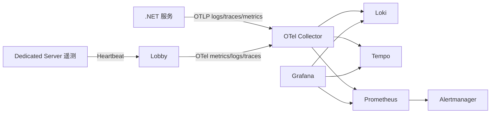

# 当前运行依赖与部署基线

> 盘点日期：2026-07-31。本文只记录仓库中的实际依赖和清单，不包含任何 `.env` 值或生产凭据。

## 1. 运行时组件

| 层 | 组件/版本 | 用途 | 持久化 |
|---|---|---|---|
| 游戏 | Unreal Engine 5.8、Client Target、Server Target | 客户端表现与权威实时牌局 | 客户端 SaveGame；DS 进程内状态 |
| 服务 | .NET 10 / ASP.NET Core | Auth、Lobby、Allocator、PlayerData、Admin | 视服务而定 |
| Web | Angular 22.0.8、TypeScript 6.0.3 | Admin 管理前端 | 构建到 Admin `wwwroot` |
| 数据库 | PostgreSQL 17 | 权威业务数据和审计历史 | PVC/Compose volume |
| 热状态 | Redis 8 | Lobby 缓存、在线、撤销、幂等、推送 | AOF everysec；仍按可丢失设计 |
| 编排 | Kubernetes + Agones | 服务部署、GameServer Fleet/Allocation | K8s/Agones 控制面 |
| 可观测 | OpenTelemetry 1.17、Prometheus 3.7.3、Grafana 12.2.0、Loki 3.7.0、Tempo 2.9.0、Alertmanager 0.28.1 | 指标、日志、Trace、告警 | Compose volumes |

## 2. NuGet 与前端依赖

中央 NuGet 版本：

| 包 | 版本 |
|---|---|
| `Microsoft.AspNetCore.Authentication.JwtBearer` | 10.0.0 |
| `Microsoft.AspNetCore.Mvc.Testing` | 10.0.0 |
| `Npgsql` | 10.0.0 |
| `StackExchange.Redis` | 2.13.1 |
| OpenTelemetry exporter/extensions/instrumentation | 1.17.0 |
| `Microsoft.NET.Test.Sdk` | 17.14.1 |
| `xunit` | 2.9.3 |
| `xunit.runner.visualstudio` | 3.1.4 |

Angular 生产依赖为 Angular 22.0.8、RxJS 7.8.2、Zone.js 0.16.2；开发依赖为 Angular CLI/Build/Compiler 22.0.8 和 TypeScript 6.0.3。`package.json` 只有 `start`、`build`、`typecheck`，没有 `lint` 和 `test`。

## 3. 配置入口

ASP.NET Core 配置采用 `appsettings.json`、环境专用 JSON、环境变量和命令行覆盖。环境变量遵循双下划线映射，例如 `Lobby__Persistence__Mode` 对应 `Lobby:Persistence:Mode`。

| 服务 | 核心配置分区 | 敏感配置类别 | 生产校验 |
|---|---|---|---|
| Auth | `Auth`、`Observability` | 令牌签名、Guest pepper、数据库连接、监控/管理凭据 | 密钥长度；禁运行时迁移 |
| Lobby | `Lobby`、`Lobby:Persistence`、`Lobby:Allocator`、`Lobby:TopologyRegistration`、`Observability` | Token/Join Ticket 签名、内部凭据、Redis/PostgreSQL、Allocator 凭据 | 凭据隔离；禁运行时迁移 |
| Allocator | `Allocator`、`Allocator:Agones`、`Allocator:TopologyRegistration`、`Observability` | 服务/管理/回调凭据、Join Ticket 密钥、ServiceAccount 文件 | 后端、端口、地址和凭据校验 |
| PlayerData | `PlayerData`、`Observability` | 数据库、来源/Admin/Chat/监控凭据、投影凭据 | 凭据隔离；禁运行时迁移 |
| Admin | `Admin` 及其 Identity/Management/Source/Archive/ABAC 分区、`Observability` | OIDC、管理/监控/证据/钱包/归档凭据和数据库连接 | 生产强制 OIDC、MFA、HTTPS、PostgreSQL、ABAC |

阶段 0 的敏感项扫描只检查“是否通过外部引用/占位符注入”，不读取或输出实际值。未发现提交的生产明文凭据；`secret.example.yaml` 明确为不可直接部署的占位示例。

## 4. Docker 与 Compose

### 4.1 Dockerfile

- `Services/GuiyangMahjong.Auth/Dockerfile`
- `Services/GuiyangMahjong.Lobby/Dockerfile`
- `Services/GuiyangMahjong.Allocator/Dockerfile`
- `Services/GuiyangMahjong.Allocator/Dockerfile.agones`
- `Services/GuiyangMahjong.Allocator/Dockerfile.windows`
- `Services/GuiyangMahjong.PlayerData/Dockerfile`
- `Services/GuiyangMahjong.Admin/Dockerfile`
- `Deploy/Docker/Dockerfile.gameserver`

### 4.2 主栈 `Deploy/linux/compose.yaml`

实际服务：PostgreSQL、一次性迁移容器、Redis、Auth、game-node（Allocator + DS 镜像）、Lobby、PlayerData、Admin。

已有：

- PostgreSQL/Redis 健康检查和命名卷；
- 应用服务健康检查；
- CPU、内存和 PID 限制；
- 应用容器只读根文件系统、受限 tmpfs、`no-new-privileges`；
- 数据库迁移与运行身份分离；
- 依赖健康条件和统一日志轮转。

风险：

- Auth/Lobby/PlayerData/Admin HTTP 端口默认发布到宿主机所有接口，生产需由防火墙或绑定地址限制；
- `depends_on` 只解决容器启动次序，不等价于业务级降级和恢复；
- game-node 将 UDP 范围发布到宿主机，必须在生产节点层限制来源；
- Compose 适合单机基线，不提供跨节点高可用。

### 4.3 可观测栈 `Deploy/observability/compose.yaml`

实际服务：Loki、Loki 查询网关、Tempo、OTel Collector、Prometheus、Alertmanager、Grafana。Loki、Tempo、Prometheus、Grafana 有命名卷。

当前缺口：

- 各容器没有统一健康检查；
- 未设置 CPU、内存和 PID 限制；
- 未统一配置非 root、只读根文件系统、capability drop；
- Grafana、Prometheus、Alertmanager、OTLP 和 Loki 查询网关端口直接发布；
- Loki 本地配置 `auth_enabled: false`，只能在受信网络中使用。

## 5. Kubernetes 与 Agones

Kubernetes 清单覆盖 Auth、Lobby、Allocator（Linux/Windows）、PlayerData、Admin、开发 PostgreSQL/Redis、迁移 Job、命名空间和示例 Secret。没有 Helm `Chart.yaml`。

| 清单 | 健康检查 | 资源限制 | 安全上下文 | 持久化/终止 |
|---|---|---|---|---|
| Auth/Lobby | readiness + liveness | 有 | 不完整 | Deployment 默认终止策略 |
| PlayerData/Admin | readiness + liveness | 有 | non-root、禁止提权、只读根、drop ALL | 无本地业务卷 |
| Linux Allocator | readiness + liveness | 有 | non-root、禁止提权、只读根、drop ALL | 10Gi PVC、60s 终止 |
| Windows Allocator | readiness + liveness | 有 | 以 `NT AUTHORITY\SYSTEM` 运行 | hostPath 状态/Outbox/Server 构建 |
| PostgreSQL/Redis 开发依赖 | readiness | 有 | 不完整 | PVC |
| 迁移 Job 示例 | Job 退出码 | 有 | non-root、只读根、drop ALL | 独立迁移身份 |

Agones 清单包括 Fleet、FleetAutoscaler、GameServerAllocation 和 SDK RBAC。Fleet 使用不可变标签占位符、non-root、资源请求/限制、60 秒终止窗口和 Secret 注入；游戏容器根文件系统当前可写，需结合结算 Outbox 的明确 volume 设计进一步收紧。

## 6. 可观测数据流

OTel Collector 对敏感属性执行删除/脱敏处理。Prometheus 加载普通告警和 SLO 规则，并指向 Alertmanager。当前 Prometheus 只静态抓取自身和 OTel Collector；服务指标依靠 OTLP 汇聚，而非逐服务 Prometheus scrape。

## 7. Trace 与请求关联

- ASP.NET Core 自动 HTTP instrumentation 已启用。
- 共享中间件建立结构化日志作用域并支持 `X-Trace-Id`。
- Lobby 明确规范化 `X-Request-Id`；Lobby → Allocator 会传播 RequestId 和业务 TraceId。
- Admin 命令和调查数据持久化 TraceId/工单号。
- 全局 `correlation_id` 尚未形成统一 Header、日志字段和持久化契约；Auth、PlayerData 与部分 Allocator 回调也没有统一的 request/correlation 三元组门禁。

## 8. 基线验证入口

| 类别 | 命令/入口 |
|---|---|
| .NET | `dotnet restore/build/test Services/GuiyangMahjong.Services.slnx` |
| Angular | `npm ci`、`npm run typecheck`、`npm run build` |
| Compose | `docker compose -f Deploy/linux/compose.yaml config`；观测栈同理 |
| Kubernetes/Agones | `Scripts/Test-KubernetesAgones.ps1` 或 `kubectl apply --dry-run=client` |
| Helm | 不适用：仓库无 Chart |
| Unreal 模块图 | `Scripts/Test-TargetModuleGraph.ps1` |
| Unreal 自动化 | UnrealEditor-Cmd 执行 `GuiyangMahjong.*` |
| 真 DS 集成 | `Scripts/Test-Phase4ManagedServer.ps1` |
| 完整牌局/重连 | `Scripts/RunFullMatchIntegration.ps1`、`Scripts/RunReconnectIntegration.ps1` |

本次阶段 0 的实际执行结果在 `current-risk-register.md` 的“验证结果”章节统一记录。
# 阶段 11 增量：配置发布依赖

Configuration 依赖 PostgreSQL 和 OpenTelemetry；发布事件经自有 Outbox 由 Workers 发送至 NATS JetStream。EdgeGateway 可选依赖 Configuration 内网 API，并在上游不可用时使用持久化 Last Known Good。Admin BFF 可选依赖 Configuration 管理 API。Dedicated Server UDP/UE 网络不经过 Configuration 或 EdgeGateway。

