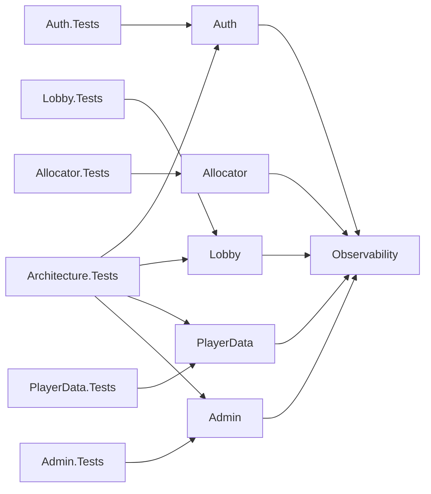
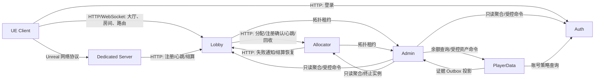

# 贵阳麻将当前系统盘点

> 阶段：平台架构升级阶段 0  
> 盘点日期：2026-07-31（Asia/Shanghai）  
> 仓库根目录：`H:\MahjongGame`  
> 基线提交：`504e81489ba3017325411f4a093e78e3f41ebf88`（`main`）  
> 事实口径：以本次盘点时的工作树、源码、项目文件和部署清单为准，不以目录名称推断实现。

## 1. 基线状态

本次盘点开始时工作区不是干净状态：有 21 个已跟踪文件被修改，并存在洗牌公平性、架构文档等未跟踪文件。阶段 0 不回退、不覆盖这些既有改动，也不把当前状态描述成可复现的干净提交。后续阶段在开始前应先由责任人决定如何提交或隔离这些改动。

阶段 0 新增八份盘点文档，并修复一处既有监控容量契约脚本对已拆分 Angular 文件的过期路径；不修改运行时代码、接口、数据结构、配置或部署行为。

## 2. .NET 解决方案

### 2.1 项目清单

`Services/GuiyangMahjong.Services.slnx` 实际包含以下项目：

| 类型 | 项目 | 主要职责 | 直接项目引用 |
|---|---|---|---|
| 生产 | `GuiyangMahjong.Auth` | 游客身份、访问令牌、刷新会话、账号控制 | `Observability` |
| 生产 | `GuiyangMahjong.Lobby` | 大厅、房间控制面、路由、DS 回调、结算落库 | `Observability` |
| 生产 | `GuiyangMahjong.Allocator` | DS 分配、进程/Agones 生命周期、实例租约 | `Observability` |
| 生产 | `GuiyangMahjong.PlayerData` | 钱包、奖励、支付/举报/回放证据投影 | `Observability` |
| 生产 | `GuiyangMahjong.Admin` | 房间/玩家聚合监控、审批、命令、调查、审计 | `Observability` |
| 生产 | `GuiyangMahjong.Observability` | 结构化日志、指标、Trace、敏感字段约束 | 无 |
| 测试 | `GuiyangMahjong.Auth.Tests` | Auth API、令牌、PostgreSQL 集成 | `Auth` |
| 测试 | `GuiyangMahjong.Lobby.Tests` | 房间、Redis/PostgreSQL、DS/结算契约 | `Lobby` |
| 测试 | `GuiyangMahjong.Allocator.Tests` | 分配、进程、Agones、恢复和管理命令 | `Allocator` |
| 测试 | `GuiyangMahjong.PlayerData.Tests` | 资产、证据、投影、PostgreSQL 集成 | `PlayerData` |
| 测试 | `GuiyangMahjong.Admin.Tests` | 聚合、RBAC/ABAC、审批、审计和调查 | `Admin` |
| 测试 | `GuiyangMahjong.Architecture.Tests` | Schema 输出隔离和项目引用边界 | `Auth`、`Lobby`、`PlayerData`、`Admin` |

所有项目由 `Directory.Build.props` 统一使用 `net10.0`、可空引用、隐式 using、确定性构建和警告即错误。NuGet 由 `Directory.Packages.props` 中央管理，关键版本包括 ASP.NET Core 10.0.0、Npgsql 10.0.0、StackExchange.Redis 2.13.1、OpenTelemetry 1.17.0、xUnit 2.9.3。

### 2.2 项目依赖图

生产项目之间没有业务程序集直接引用，运行时通过 HTTP 契约通信。

### 2.3 启动入口与持久化模式

| 服务 | 启动入口 | 默认持久化 | 生产约束 |
|---|---|---|---|
| Auth | 顶级语句 `Program.cs` | `InMemory` 或 PostgreSQL | 生产禁止运行时迁移 |
| Lobby | 顶级语句 `Program.cs` | `InMemory` 或 Redis + PostgreSQL | 生产禁止运行时迁移；Redis 仅热状态 |
| Allocator | 顶级语句 `Program.cs` | JSON 状态文件、结算恢复目录；可选 Agones | 本地进程或 Agones 二选一 |
| PlayerData | 顶级语句 `Program.cs` | `InMemory` 或 PostgreSQL | 生产禁止运行时迁移 |
| Admin | 顶级语句 `Program.cs` | `InMemory` 或 PostgreSQL | 生产管理必须 PostgreSQL；生产禁止运行时迁移 |

数据库变更不是 EF Core Migration，而是服务自有 `Storage/schema.sql`。`Directory.Build.targets` 将 Schema 发布到互不覆盖的 `Schemas/{Service}/schema.sql`。当前脚本以 `CREATE ... IF NOT EXISTS`、`ALTER ... IF NOT EXISTS` 为主，没有版本号、迁移账本和自动 downgrade。

## 3. 运行时通信拓扑

当前不存在 EdgeGateway。客户端 HTTP 直接访问 Auth 和 Lobby；UE Client 与 DS 的实时牌局网络流量不经过 HTTP 网关。

## 4. Unreal Engine 工程

### 4.1 Target

| Target | 类型 | 项目模块 | 结论 |
|---|---|---|---|
| `GuiyangMahjong.Target.cs` | Game | `GuiyangMahjong`、`GuiyangMahjongOnline`、`GuiyangMahjongClient` | 常规客户端，不含 Server/EditorTools |
| `GuiyangMahjongClient.Target.cs` | Client | 同上 | 不含 ServerOnly、Agones |
| `GuiyangMahjongServer.Target.cs` | Server | `GuiyangMahjong`、`GuiyangMahjongServer` | 不含项目 Client/Online 模块且 `bUsesSlate=false`；完整 UBT 图仍传递包含 UMG/Slate |
| `GuiyangMahjongEditor.Target.cs` | Editor | 六个模块中的运行时模块及 `EditorTools` | EditorTools 只进入编辑器 |

### 4.2 模块职责与依赖

| 模块 | 主要职责 | 关键直接依赖 | 边界结论 |
|---|---|---|---|
| `GuiyangMahjongCore` | 牌、规则、牌桌引擎、共享 DTO | Core、CoreUObject、Engine | 未依赖 UI、HTTP、Agones、编辑器 |
| `GuiyangMahjong` | 共享 GameState/PlayerState/PlayerController 和网络 RPC | Core、Engine、Core 模块、Networking/Sockets/NetCore | Client/Server 共享；包含 Client RPC 声明但不含 UMG |
| `GuiyangMahjongOnline` | 登录与会话 HTTP | Core、Engine、Core 模块、HTTP/Json | 仅 Client/Game/Editor |
| `GuiyangMahjongClient` | UMG、音频、表现、Lobby 客户端、重连 UI | 共享模块、Online、UMG/Slate、HTTP | 未进入 Server Target |
| `GuiyangMahjongServer` | 权威房间、牌局、Join Ticket、DS 桥、Agones | 共享模块、HTTP/Json、Agones、网络模块 | 未进入 Client Target；自身 Build.cs 不直接引用 UMG/Slate |
| `GuiyangMahjongEditorTools` | 资源生成、编辑器审查、自动化测试 | 全部项目模块、UnrealEd/UMGEditor | 仅 Editor Target |

本次 UBT `JsonExport` 实际得到 Client 259 个模块、Server 232 个模块：Client 不含 `GuiyangMahjongServer`/Agones，Server 不含项目 `GuiyangMahjongClient`/`GuiyangMahjongOnline`，两者都不含 EditorTools；但 Server 可执行文件仍包含 `Slate`、`SlateCore`、`UMG`。原因是 UE 5.8 的 `Engine.Build.cs` 把这些模块作为 Engine 的传递依赖，`bUsesSlate=false` 并未把它们从完整单体链接图移除。

因此四项重点检查中，ClientOnly、EditorTools 和 Core 直接依赖边界满足；“Server 发布目标完全不含 UMG/表现模块代码”不满足。现有 `Scripts/Test-TargetModuleGraph.ps1` 的禁止列表也没有覆盖 UMG/Slate，应在后续阶段明确可实现的引擎级裁剪目标和门禁口径。

## 5. 核心状态权威

| 状态 | 当前权威 |
|---|---|
| 玩家身份、刷新会话、账号控制 | Auth PostgreSQL |
| 房间控制面、成员映射、结算记录、房间历史 | Lobby PostgreSQL |
| 实时牌局、手牌、操作合法性、回合和局内结算 | Dedicated Server 内存 |
| DS 实例租约和进程/Agones 生命周期 | Allocator 状态存储 + 运行时 |
| 玩家资产、奖励和证据源记录 | PlayerData PostgreSQL |
| 管理审批、命令 Outbox、调查、审计账本 | Admin PostgreSQL |
| 房间热快照、在线、撤销水位、实时推送 | Lobby Redis，非长期权威 |

DS 不直接连接 PostgreSQL，也不修改玩家资产、奖励、订单或支付记录。当前最终牌局结果由 DS 以实例专用凭据提交给 Lobby，Lobby 做范围、序列、玩家集合及公平性证明校验后幂等落库；PlayerData 的资产变化走独立受控命令。

## 6. 自动化基线入口

| 主链路 | 当前入口 | 覆盖性质 | 状态 |
|---|---|---|---|
| 游客登录 | `AuthApiTests.GuestLogin_*`；UE `GuiyangMahjong.Auth.GuestLoginLifecycle` | API + UE 本地生命周期 | 已有 |
| 刷新令牌 | `RefreshToken_IsRotatedAndCannotBeReused`；PostgreSQL 跨实例测试 | API + 外部依赖集成 | 已有 |
| 创建好友房 | `LobbyApiTests.ConcurrentHttpCreation_*`、`RoomDomainTests` | API/领域 | 已有 |
| 加入好友房 | `RoomDomainTests.ConcurrentJoin_*`、密码/容量测试 | 领域/API | 已有 |
| 分配 DS | `AllocatorIntegrationDomainTests`、`Test-Phase3Integration.ps1` | 服务集成 | 已有 |
| DS 注册 | `GameServerInstanceManagerTests`、`Test-Phase4ManagedServer.ps1` | 领域 + 真进程 | 已有 |
| 获取 Join Ticket | `Route_IsUnavailableUntilRegistrationThenGetsShortLivedTicket` | 服务集成 | 已有 |
| 玩家进入 DS | UE `GuiyangManagedGameServerTests`、`RunFullMatchIntegration.ps1` | UE 自动化/多进程 | 已有，依赖 UE |
| 断线重连 | `RunReconnectIntegration.ps1`、UE 重连测试 | 多进程 | 已有，依赖 UE |
| 完成一局 | `RunFullMatchIntegration.ps1`、牌桌规则测试 | 多进程/规则 | 已有，依赖 UE |
| 提交结算 | `MatchResultEndpoint_*`、`MatchResult_*PersistedOnce*` | API/服务集成 | 已有 |
| Admin 查询房间和玩家 | `AdminApiTests.AuthorizedOverview*`、`AuthorizedPlayerDirectory*` | API | 已有 |

UE 多进程流程不能在纯 `.NET` 测试中完全替代，原因是它们依赖 NetDriver、地图加载、Client RPC、PreLogin/PostLogin 和真实进程生命周期。可重复入口已经存在，输出位于 `Saved/Integration/.../result.json` 和对应日志。测试替身包括 Allocator 进程启动器、Agones 客户端、Lobby/监控 HTTP Handler 与可控 TimeProvider。

## 7. 阶段 0 变更边界

- API 变化：无。
- PostgreSQL 变化：无。
- Redis 变化：无。
- 消息/事件变化：无。
- 配置变化：无。
- 兼容策略：运行时零变更。
- 回滚：删除阶段 0 新增文档。
