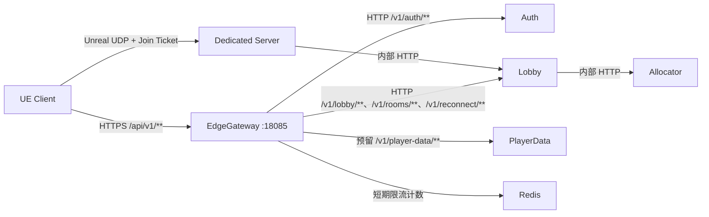

# 阶段 1：Player EdgeGateway 统一接入

> 实施日期：2026-07-31  
> 基线：阶段 0 当前架构盘点  
> 范围：玩家 HTTP/WebSocket 控制面接入，不包含 Dedicated Server 的 Unreal UDP/游戏网络

## 1. 阶段目标和边界

本阶段在不重构 Auth、Lobby、Allocator 和 PlayerData 内部业务逻辑的前提下，新增 `.NET 10 + ASP.NET Core + YARP` Player EdgeGateway。UE 客户端使用统一 `ApiBaseUrl` 访问玩家 HTTP API，Lobby 返回的 Dedicated Server IP、UDP 端口和 Join Ticket 仍由 Unreal travel 直接连接游戏服。

本阶段没有：

- 修改旧业务接口请求或响应结构；
- 暴露任何 `/internal`、Admin 或 Allocator 接口；
- 让网关访问 PostgreSQL；
- 让网关分配或启动 Dedicated Server；
- 修改结算、麻将规则或房间状态机；
- 引入 NATS 或新的业务事件；
- 为 POST 增加透明重试。

## 2. 运行拓扑



EdgeGateway 只引用 `GuiyangMahjong.Observability`，不引用任何业务服务程序集，也不包含 Npgsql。

## 3. 外部路由与兼容映射

| 网关路径 | YARP Cluster | 实际下游路径 | 认证 |
|---|---|---|---|
| `/api/v1/auth/{**catch-all}` | `auth` | 删除 `/api`，得到 `/v1/auth/**` | 匿名框架；客户端契约头仍必需 |
| `/api/v1/lobby/{**catch-all}` | `lobby` | 删除 `/api`，得到 `/v1/lobby/**` | Player |
| `/api/v1/rooms/{**catch-all}` | `lobby` | 删除 `/api`，得到 `/v1/rooms/**` | Player |
| `/api/v1/game/{**catch-all}` | `lobby` | PathPattern `/v1/{**catch-all}` | Player |
| `/api/v1/player-data/{**catch-all}` | `player-data` | 删除 `/api`，得到 `/v1/player-data/**` | Player |

当前 PlayerData 没有玩家公开接口，因此最后一条是受认证的预留路由。它不会映射到 `/internal`；当前请求由 PlayerData 正常返回 404。后续新增玩家数据 API 时必须先在 PlayerData 建立 `/v1/player-data/**` 公开契约。

旧 Auth/Lobby 路径没有删除，响应由 YARP 流式透传。业务服务主动返回的 4xx/5xx 正文不会被网关错误中间件覆盖。

## 4. 认证与授权

当前 Auth Access Token 是两段式 `Base64Url(payload).Base64Url(HMAC-SHA256)`，不是标准三段 JWT。为了保持兼容，网关的 `PlayerAccess` 策略按令牌段数选择：

1. `LegacyPlayer`：本地验证当前 Auth HMAC 签名、`sub/name/provider`、签发时间和过期时间；
2. `JwtPlayer`：使用 ASP.NET Core JwtBearer 验证标准 JWT 的签名、时间、可选 issuer 和 audience；
3. `Player`：要求认证成功并具有 `sub`；
4. `Management`：要求标准 JWT 和 `GatewayAdministrator` 角色，但本阶段没有任何玩家路由使用该策略。

网关不会把解析出的玩家身份写成 `X-Player-Id` 等可信头。原始 `Authorization` 继续转发，Lobby 必须再次验证 Token 及 Redis 撤销水位。

## 5. 请求安全管线

请求按以下顺序处理：

1. 删除伪造身份、权限、内部服务、方法覆盖和路由头；
2. 仅对显式 `TrustedProxies`/`TrustedProxyNetworks` 消费 Forwarded Headers；
3. 生成或规范化 `X-Request-Id` 和 `X-Correlation-Id`；
4. 执行 Host 白名单并以统一 JSON 返回拒绝结果；
5. 建立 W3C Activity、结构化日志作用域和 Trace/Metric；
6. 校验请求大小、Content-Type、客户端版本、协议、平台和渠道；
7. 本地验证 Access Token；
8. 执行 ASP.NET Core 进程内固定窗口限流；
9. 执行 Redis 跨实例固定窗口限流；
10. 应用路由级超时并转发到健康上游。

无论客户端是否提供，以下头都会在到达下游前被删除或覆盖：

- `X-Player-Id`、`X-User-Id`、`X-Account-Id`、`X-Session-Id`；
- `X-Role`、`X-Permissions`；
- `X-Internal-*`、`X-Service-*`；
- 非可信来源的 `Forwarded`、`X-Forwarded-*`、`X-Original-*`；
- `X-HTTP-Method-Override`、`X-Method-Override`、`X-Original-URL`；
- `X-Edge-Route`。

## 6. Redis 限流

Redis 只保存可丢失的短期窗口计数：

```text
{KeyPrefix}:{SHA256(subject)前24位}:{unix-window}
```

默认前缀为 `guiyang:edge:ratelimit:v1`。Lua 脚本原子执行 `INCR` 和首次 `PEXPIRE`，TTL 为窗口时间加 5 秒。键不保存原始 PlayerId 或 IP，不能作为账号、会话或业务权威状态。

生产要求：

- `DistributedRateLimit.Enabled=true`；
- `ConnectionString` 由环境注入；
- `FailClosed=true`；
- Redis 故障时 Ready 失败，玩家请求返回统一 503。

## 7. 健康、超时和错误

| 端点/状态 | 行为 |
|---|---|
| `/health/live` | 只检查 ASP.NET Core 进程可响应 |
| `/health/startup` | 检查应用是否已完成 Started 生命周期 |
| `/health/ready` | 检查 Auth、Lobby、PlayerData readiness 和 Redis 限流后端 |
| 400 | 客户端契约、平台、渠道或请求格式无效 |
| 401 | Access Token 缺失、格式错误、签名错误或过期 |
| 403 | 已认证但不满足授权策略 |
| 413 | 请求体超过 `MaximumRequestBodyBytes` |
| 415 | 有正文的写请求不是 JSON |
| 426 | 客户端版本或协议不受支持 |
| 429 | 本机或 Redis 限流拒绝，带 `Retry-After` |
| 502 | 与已选上游建立连接或转发失败 |
| 503 | 无健康上游或限流后端失败关闭 |
| 504 | 路由请求超时 |

YARP Cluster 同时配置 `/health/ready` 主动健康检查。路由没有 RetryPolicy，POST、奖励、资产、结算及 GM 命令不会被网关透明重试。

## 8. 配置与环境变量

ASP.NET Core 使用 `__` 覆盖层级。主要配置如下：

| 配置 | 默认值 | 生产覆盖示例 |
|---|---:|---|
| `EdgeGateway:MaximumRequestBodyBytes` | `1048576` | `EdgeGateway__MaximumRequestBodyBytes` |
| `EdgeGateway:RouteTimeoutMilliseconds` | `10000` | `EdgeGateway__RouteTimeoutMilliseconds` |
| `EdgeGateway:TrustedProxies` | loopback | `EdgeGateway__TrustedProxies__0` |
| `EdgeGateway:TrustedProxyNetworks` | 空 | `EdgeGateway__TrustedProxyNetworks__0` |
| `EdgeGateway:PlayerTokens:LegacySigningKey` | 空，启动校验失败 | `EdgeGateway__PlayerTokens__LegacySigningKey` |
| `EdgeGateway:PlayerTokens:JwtSigningKey` | 空时使用 Legacy key | `EdgeGateway__PlayerTokens__JwtSigningKey` |
| `EdgeGateway:ClientContract:MinimumClientVersion` | `1.0.0` | `EdgeGateway__ClientContract__MinimumClientVersion` |
| `EdgeGateway:DistributedRateLimit:Enabled` | `false` | Compose 生产设为 `true` |
| `ReverseProxy:Clusters:*:Destinations:primary:Address` | loopback | Compose 覆盖为容器服务名 |
| `EdgeGateway__AllowedHosts` | loopback host | `EDGE_ALLOWED_HOSTS` |

生产不能设置无约束的 `ASPNETCORE_FORWARDEDHEADERS_ENABLED=true`，否则会绕过显式可信代理边界。

## 9. UE 客户端配置

新统一配置节：

```ini
[/Script/GuiyangMahjongOnline.GuiyangPlatformEndpoints]
ApiBaseUrl=
RealtimeBaseUrl=
PatchBaseUrl=
ClientVersion=1.0.0
ProtocolVersion=1
Platform=
Channel=default
```

命令行覆盖：

```text
-MahjongApiBaseUrl=https://api.example.com
-MahjongRealtimeBaseUrl=wss://realtime.example.com
-MahjongPatchBaseUrl=https://patch.example.com
-MahjongClientVersion=1.0.0
-MahjongProtocolVersion=1
-MahjongChannel=appstore
```

所有 Auth/Lobby HTTP 请求会增加 `X-Request-Id`、`X-Correlation-Id`、`X-Client-Version`、`X-Protocol-Version`、`X-Platform` 和 `X-Channel`。Token 仍只放在 Authorization 或认证请求正文中，不进入日志。

旧 `AuthBaseUrl`、`RemoteBaseUrl`、`MahjongAuthBaseUrl` 和 `MahjongLobbyBaseUrl` 保留兼容。只有统一 `ApiBaseUrl` 缺失时才使用旧入口，并输出不包含实际地址的废弃警告。

## 10. Docker Compose

`Deploy/linux/compose.yaml` 新增 `edge-gateway`：

- 玩家入口默认端口 `18085`；
- Auth、Lobby、PlayerData 旧端口改为只绑定 `127.0.0.1`；
- 网关通过 Compose 内网服务名访问上游；
- Redis 分布式限流在 Production 中启用并失败关闭；
- 容器使用非 root、只读根文件系统、tmpfs、资源和 PID 限制；
- readiness 成功后才视为服务可用。

Allocator/GameServer UDP 端口映射保持原样，不经过 EdgeGateway。

## 11. 测试基线

`GuiyangMahjong.EdgeGateway.Tests` 使用临时 loopback Kestrel 上游验证真实 YARP 网络转发，覆盖：

- Auth/Lobby/Rooms/Game/PlayerData 路由与 Path Transform；
- 当前两段式 Token、有效 JWT、无效 JWT、匿名与授权入口；
- 身份/Internal/Service/Forwarded Header 清洗；
- Host、客户端版本、协议、平台和渠道门禁；
- 429、413、415、502/503、504；
- Request ID、Correlation ID 和 W3C traceparent；
- Live、Startup、Ready；
- 网关程序集不引用业务服务或 Npgsql。

UE 自动化测试增加统一网关 URL、`game/reconnect` 映射和旧直连回滚路径断言。

## 12. 回滚

网关异常需要紧急回滚时：

1. 客户端恢复 `MahjongAuthBaseUrl` 和 `MahjongLobbyBaseUrl` 旧参数，不再传 `MahjongApiBaseUrl`；
2. 旧参数触发 `LegacyDirect`，请求继续使用原 `/v1` 路径；
3. Compose 中 Auth、Lobby 的 loopback 端口可供同机回滚验证；
4. 如确需恢复外部直连，再由部署变更恢复旧端口发布和防火墙规则；
5. 停止 `edge-gateway` 不影响 DS UDP、Allocator、DS 注册、心跳或结算内部链路。

回滚不会涉及数据库迁移、Redis 数据迁移或业务事件补偿。

## 13. 已知限制和后续前置条件

- Auth 仍签发自定义两段式 HMAC Token；标准 JWT 只是网关兼容验证入口，本阶段没有改变 Auth。
- PlayerData 尚无玩家公开 API；不得通过网关临时暴露 `/internal`。
- RealtimeBaseUrl 和 PatchBaseUrl 已统一配置，但当前阶段没有新增独立实时服务或补丁服务。
- 单一 HMAC 密钥仍需要分发给 Auth、Lobby 和 EdgeGateway；后续可在不破坏兼容的前提下演进为非对称 JWT/JWKS。
- 生产部署必须按真实 Ingress/LB 配置 TrustedProxies/TrustedProxyNetworks 和 AllowedHosts。

## 14. 本阶段实际验证结果

| 验证 | 结果 |
|---|---|
| `dotnet restore Services/GuiyangMahjong.Services.slnx` | 通过 |
| .NET Release build | 14 个项目通过，0 warning、0 error |
| .NET 常规测试 | 183 通过、0 失败、17 个显式外部持久化测试跳过 |
| EdgeGateway 隔离 Redis 8 测试 | 1 通过、0 失败；临时容器已删除 |
| EdgeGateway 路由与安全测试 | 26 通过、0 失败 |
| Compose `config --quiet` | 通过；使用安全占位变量且未读取 `.env` |
| EdgeGateway Docker build | 通过 |
| EdgeGateway 独立容器 `/health/live` | 通过；临时容器已删除 |
| PowerShell 入口语法 | 4 个脚本通过 |
| Package isolation | 通过 |
| Observability/Governance/Capacity 契约 | 通过 |
| UBT Client/Server JsonExport 模块边界 | 通过：Client 无 Server/Agones，Server 无 Client/Online |
| UE Client 当前源码构建 | 受阶段开始前的长期 Server UBT 构建占用，未进入有效编译 |
| UE Server 当前源码构建 | 失败；阶段前已有 `GuiyangFairShuffle.cpp` 引入 OpenSSL 后与 Unreal `namespace UI` 发生类型名冲突，本阶段未修改该文件 |
| UE 自动化测试 | 因当前源码未生成可用 Editor 二进制，未以旧二进制执行 |
| 项目结构治理门禁 | 阶段实施时曾被未登记的旧架构快照阻止；该旧文档已在现行文档治理中删除 |

因此，EdgeGateway、.NET、Docker 和配置验收通过；整个仓库的“编译和测试全部通过”仍受阶段外 Unreal 公平性代码错误阻止。修复该既有错误后必须重新执行 Client、Server 构建和 `GuiyangMahjong.*` 自动化测试，才能给出阶段 1 的最终无条件通过结论。
