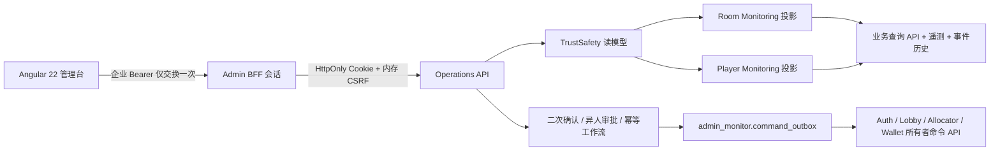

# 阶段10：Admin、TrustSafety、玩家监控和房间监控升级报告

## 1. 阶段结论

本阶段在现有 `GuiyangMahjong.Admin` 单部署单元上完成增量升级，没有拆分业务服务，也没有改变麻将规则、结算权威或 Dedicated Server 网络路径。Angular 现在通过 BFF 短期会话访问受控 Operations API；Admin 仍只写 `admin_monitor`，所有业务副作用继续发送给数据所有者的管理命令 API。

当前验收结论：核心实现完成并通过本地编译、自动化测试、PostgreSQL 17 前滚/回滚、Angular 生产构建、Compose 和离线 Kubernetes YAML 校验。退款、规则发布、配置发布和批量处罚因仓库尚无对应权威业务所有者，本阶段只建立受控动作契约并默认失败关闭，未伪造执行成功；这是进入相关业务阶段前的明确前置条件。

## 2. 实施前真实状态

- Admin 已具备企业 JWT、MFA Claim、RBAC、ABAC、二次确认、异人审批、命令 Outbox、哈希链审计、只读监控聚合和按面板降级。
- Angular 22/TypeScript 6 位于 `Services/GuiyangMahjong.Admin/ClientApp`，令牌只驻留内存，但浏览器仍需给每个请求附加 Bearer，缺少 BFF Cookie 和 CSRF。
- 房间监控已覆盖性能、网络、RPC、事件和结算，但 `RoomEpoch`、动作/状态版本、快照年龄、恢复状态未形成统一视图。
- 玩家监控已覆盖 Session、设备、房间、延迟、掉线、托管和制裁，但缺少丢包、重连次数、非法动作计数及统一角色级脱敏。
- Admin 项目不引用 Auth、Lobby、Allocator、PlayerData 或 GameData 实现，不包含 Kubernetes/Agones SDK；SQL 写入均限定在 `admin_monitor`。

## 3. 目标调用边界

明确禁止的路径仍不存在：Angular 不能连接 PostgreSQL；Admin 不能写 Room、Settlement、Inventory 表，不能读取 DS 内存，也不持有 Kubernetes/Agones 权限。

## 4. 已完成能力

### 4.1 管理员认证与 BFF

- 新增 `POST/GET/DELETE /admin/bff/v1/session`。
- 企业 Access Token 只用于建立短期会话，不保存到服务端、Web Storage、URL 或日志。
- Cookie 为不透明随机值，生产使用 `__Host-`、Secure、HttpOnly、SameSite=Strict；数据库只保存 SHA-256 摘要。
- Cookie 写请求强制 `X-Admin-CSRF` 固定时间校验；GET/HEAD/OPTIONS 不要求 CSRF。
- 会话绑定设备摘要和 IPv4 `/24` 或 IPv6 `/56` 网络前缀摘要；变化时拒绝并写登录安全事件。
- 会话有效期取配置窗口与企业凭证 `exp` 的较早值，不得延长企业身份撤销 SLA；生产强制 PostgreSQL 多副本存储、HTTPS、MFA、设备/IP 绑定。
- 原 `/admin/v1/**` 和 Bearer 自动化调用保留兼容；新增 `/admin/operations/v1/**` 同处理器映射，避免授权逻辑分叉。

### 4.2 TrustSafety 模块

已建立可执行代码边界：Risk、AntiCheat、RoomMonitoring、PlayerMonitoring、Investigations、Sanctions 和 Audit 由 `TrustSafetyReadModelService` 统一组合。它只读取受控业务 API、遥测和 Admin 自有案件投影，不执行处罚，也不持续轮询 DS 内存。

规范只读入口：

- `GET /admin/operations/v1/trust-safety/rooms/{roomId}`
- `GET /admin/operations/v1/trust-safety/players/{playerId}`

房间规范视图包含状态版本、Room Epoch、DS/Provider/Fleet、Build、RuleSet、座位与连接、动作序号、快照版本/年龄、恢复状态、性能、风险事件、TraceId、来源和最后更新时间。生产者尚未上报的可选字段返回 `null`，不伪装为零。

玩家规范视图包含账号、Session 摘要、设备摘要、当前房间/实例、延迟、丢包、掉线、重连、托管、非法动作、风险标签、处罚、授权工单、来源、最后更新时间和数据年龄。手机号、完整 IP、原始第三方标识未进入模型；普通查看者只能看到不可逆设备摘要和更粗粒度网络信息。默认响应不枚举工单，只有显式提供 `caseId` 且通过案件归属 ABAC 后才返回对应工单。

### 4.3 高风险操作治理

所有现有高风险动作继续执行：RBAC + ABAC、实时前置状态、二次确认、异人审批、幂等、命令 Outbox、业务所有者 API 和不可变审计。

动作记录新增并持久化：

- `reason_code`
- `operation_description`
- `confirmation`
- `idempotency_key`

既有字段继续包含操作人员、申请/审批时间、原因、前后状态、审批 ID/记录、TraceId 和关联工单。普通运营没有修改对局结果的动作类型或 API。

新增动作枚举 `OrderRefund`、`RulePublish`、`ConfigurationPublish`、`BatchSanction` 及独立角色白名单。由于对应权威服务尚不存在，创建请求返回 `503 ADMIN_OWNER_CAPABILITY_UNAVAILABLE`；Admin 不会自行写订单、规则、配置或批量修改 Auth 表。

## 5. API、数据、Redis、事件与配置变化

### API

- 新增 BFF Session 三个端点。
- 新增 Operations 兼容前缀和两个 TrustSafety 规范只读端点。
- `CreateAdminActionRequest` 新增可选 `reasonCode`、`operationDescription`；旧请求缺失时分别使用 `LEGACY_UNSPECIFIED` 和已验证原因文本。
- 现有响应结构只增加可选字段，不删除或重命名旧字段。

### PostgreSQL

所有权：Admin；Schema：`admin_monitor`。

- 新表 `admin_sessions`：不透明会话/CSRF/设备/IP 摘要与授权快照。
- 新表 `admin_login_security_events`：追加式登录安全证据，触发器禁止更新、删除和清空。
- `action_requests` 新增四个结构化治理字段。
- `mahjong_admin_rw` 只获得上述 Admin 自有表的必要权限；没有获得业务 Schema 写权限。

迁移顺序：先由 `mahjong_migration` 应用 `Services/GuiyangMahjong.Admin/Storage/schema.sql`，再应用最小权限脚本，最后启动 Admin。生产保持 `ApplyDatabaseMigrations=false`。

### Redis 与消息

Redis 无变化。管理员会话是需要跨副本撤销的安全状态，选择 PostgreSQL 而非把 Redis 当作唯一权威。没有新增业务事件；管理命令继续使用 Admin 本地事务 Outbox，避免绕过现有所有者 API。

### 配置

`Admin:WebSecurity` 新增：

- `BrowserSessionEnabled=true`
- `SessionCookieName`（开发 `mahjong-admin-dev`，生产 `__Host-mahjong-admin`）
- `SessionLifetimeMinutes=10`
- `CsrfHeaderName=X-Admin-CSRF`
- `BindDevice=true`
- `BindIpNetwork=true`

Linux Compose 和 Kubernetes ConfigMap 已提供环境变量覆盖。生产启动校验会拒绝非 HTTPS、非 `__Host-` Cookie、关闭设备/IP 绑定或非 PostgreSQL 会话持久化。

## 6. 测试覆盖

- 管理员企业身份、MFA、短令牌年龄与已知角色映射。
- BFF 会话交换、HttpOnly Cookie、Operations 别名、注销和撤销。
- Cookie 写操作 CSRF、异常设备绑定拒绝、拒绝信息不泄露原始设备。
- 高风险结构化原因、确认和幂等键持久化。
- 普通玩家查看者的设备/IP 角色脱敏。
- TrustSafety 房间规范视图及 Join Ticket 不泄漏。
- 退款/发布/批量处罚缺少所有者时失败关闭。
- Admin 项目引用、业务表写入和 Kubernetes/Agones 依赖架构门禁。
- Angular CSRF 方法分类、受控认证错误、Web Storage 禁用扫描、TypeScript 和生产构建。
- PostgreSQL 17 会话跨实例读取、撤销、登录事件、动作字段、审批/Outbox 并发、Schema 前滚与精确回滚。

## 7. 验证结果

最终命令和数量以本报告最后一次验证为准：

- `dotnet restore Services/GuiyangMahjong.Services.slnx`：通过。
- `dotnet build ... --no-restore`：通过，0 警告、0 错误。
- `dotnet test ... --no-build --no-restore -m:1`：271 通过、24 条外部依赖条件测试按设计跳过、0 失败。首次并行运行出现 1 次既有 Allocator 端口竞争用例失败；该用例独立复跑及串行全量复跑均通过，因此基线采用避免跨项目争抢本机端口的串行命令。
- Admin 定向测试：77 通过、4 条外部 PostgreSQL 条件测试按设计跳过；临时 PostgreSQL 17 下 4 条外部持久化测试全部通过。
- Architecture：13 通过。
- Lobby：62 通过、8 条外部条件跳过。
- Angular：`npm ci`、`npm run lint`、`npm run test`（3 项，包含数据源独立降级）、`npm run build` 全部通过，生产首包 149.95 kB。
- PostgreSQL 17：Schema 前滚、4 项真实持久化测试、阶段10回滚和残留表检查通过，回滚后阶段10会话表残留数为 0。
- Linux、Observability、Capacity 三份 Compose `config --quiet` 通过，未读取 `.env`，仅注入安全占位值。
- Kubernetes/Agones：17 个 YAML 文件、47 个文档离线解析通过；本机无可连接集群，`kubectl --dry-run=client` 因 API discovery 失败，未宣称集群准入通过。
- Helm：仓库 `Deploy` 下无 `Chart.yaml`，不适用，未伪报通过。

## 8. 回滚

1. 将 Angular 与 Admin 镜像回滚到上一版本。
2. 设置 `Admin__WebSecurity__BrowserSessionEnabled=false`，恢复旧内存 Bearer 兼容入口。
3. 保留新增列和安全事件以便审计；如合规审批明确要求删除阶段10会话结构，先确认所有会话已失效，再由迁移身份执行 `Storage/rollback-stage10.sql`。
4. `/admin/operations/v1` 是别名，回滚后客户端恢复 `/admin/v1`；业务所有者 API 和现有命令 Outbox 不需要回滚。
5. 回滚不会修改房间、结算、资产或玩家权威数据。

## 9. 未完成内容与下一阶段前置条件

- 建立订单/支付所有者的幂等退款 API 后，才能启用 `OrderRefund`。
- 建立规则与配置发布所有者、版本库、签名和灰度/回滚能力后，才能启用发布动作。
- 建立支持部分失败补偿和逐玩家结果的批量处罚所有者 API 后，才能启用 `BatchSanction`。
- 在具备企业 IdP 和测试集群的环境执行真实 OIDC/MFA、反向代理 HTTPS、Cookie、网络漂移和 Kubernetes Admission/NetworkPolicy 验证。
- DS 生产构建需要开始上报新增遥测可选字段，之后才能将快照年龄、非法动作和丢包从“可选”提升为 SLO 门禁。

在这些前置条件完成前，相关高风险动作保持失败关闭；这不阻塞现有房间终止、封禁、强制下线、补偿、调查、回放和审计能力使用。
