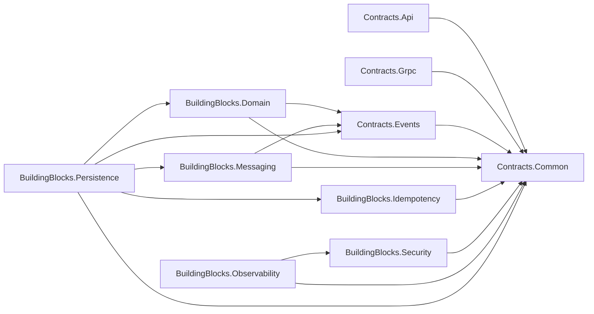

# 阶段 2：统一 Contracts 与 BuildingBlocks

> 实施日期：2026-07-31  
> 范围：共享契约和基础构件，不接入现有业务流程  
> 基线：阶段 1 EdgeGateway 及阶段 0 架构盘点

## 1. 目标与非目标

本阶段新增统一强类型 ID、API/gRPC/事件契约、Outbox、Inbox、API 幂等、安全上下文和调用链传播基础能力，为后续 Identity、LobbyControl、Allocation、GameData 渐进引用提供稳定依赖方向。

本阶段没有：

- 重构或拆分 Auth、Lobby、Allocator、PlayerData；
- 修改现有 HTTP 请求/响应、Redis 键、数据库业务表或 UE/DS；
- 把现有 Lobby Redis 幂等、Admin/PlayerData 专用 Outbox 迁移到新构件；
- 注册正式 NATS、创建消息监听端口或发送生产事件；
- 让 EdgeGateway 保存业务幂等响应；
- 修改麻将规则、结算或房间状态机。

## 2. 实际基线分析

- 原仓库只有 `GuiyangMahjong.Observability` 共享项目，负责 ASP.NET Core 和 OpenTelemetry 主机集成；新 Observability BuildingBlock 只补充跨 HTTP/gRPC/事件的调用上下文传播，继续复用原项目的主机能力。
- Lobby 原有内存/Redis 幂等仅按 Key 缓存 HTTP 响应，没有请求指纹和数据库唯一约束。本阶段保留原实现，避免改变现有房间行为。
- Admin 和 PlayerData 已有业务专用 PostgreSQL Outbox，Allocator 有文件型结算恢复 Outbox。新 Outbox 是后续模块的公共能力，不与既有实现双写。
- 原仓库没有通用 Inbox、事件信封、强类型 ID 或 gRPC proto。
- 当前数据库迁移方式是服务随包发布 `schema.sql` 并按配置初始化。新基础构件提供显式迁移模板和迁移 API，但不会自动对任何现有服务 Schema 执行。

## 3. 项目结构与依赖

```text
Services/
├─ Contracts/
│  ├─ GuiyangMahjong.Contracts.Common
│  ├─ GuiyangMahjong.Contracts.Api
│  ├─ GuiyangMahjong.Contracts.Grpc
│  └─ GuiyangMahjong.Contracts.Events
└─ BuildingBlocks/
   ├─ GuiyangMahjong.BuildingBlocks.Domain
   ├─ GuiyangMahjong.BuildingBlocks.Messaging
   ├─ GuiyangMahjong.BuildingBlocks.Idempotency
   ├─ GuiyangMahjong.BuildingBlocks.Security
   ├─ GuiyangMahjong.BuildingBlocks.Observability
   ├─ GuiyangMahjong.BuildingBlocks.Persistence
   └─ GuiyangMahjong.BuildingBlocks.Tests
```

依赖方向：



Contracts 不引用 ASP.NET Core、Npgsql、Entity Framework 或业务服务。Domain 不引用 ASP.NET Core。只有 Persistence 引用 Npgsql。架构测试会读取全部新项目文件并失败关闭。

## 4. 强类型 ID

已定义：

- `PlayerId`、`AccountId`、`SessionId`、`DeviceId`；
- `RoomId`、`MatchId`、`RoundId`、`ServerInstanceId`、`AllocationId`；
- `RoomEpoch`、`ActionSequence`、`StateVersion`；
- `RuleSetVersion`、`BuildVersion`；
- `EventId`、`CorrelationId`、`IdempotencyKey`。

字符串标识只接受 `[A-Za-z0-9._:-]` 安全集合，最长 128 字符；Correlation/Idempotency Key 至少 8 字符；版本使用数字点段和可选 prerelease/build 后缀；数值版本和序号拒绝负数。

JSON 转换器在授权传输边界读写原值。普通 `ToString()` 和 DebuggerDisplay 只输出 SHA-256 短指纹，不自动泄漏玩家、账号、会话和设备标识。Persistence 使用 `IStrongValue.ToDatabaseValue()` 显式写入标量，不会误把脱敏字符串持久化。

## 5. API、gRPC 与调用上下文

`Contracts.Api` 提供稳定错误码、传输中立 `ApiProblem` 和 `ApiResponseContext`，业务服务可以适配 RFC Problem Details 或当前响应模型，不要求本阶段修改旧 API。

`Contracts.Grpc` 发布 `platform_context_v1.proto`，定义：

- `CallContext`；
- `ErrorDetail`；
- `CommandAcknowledgement`。

本阶段不生成服务端实现、不打开 gRPC 端口。破坏性变更必须使用新的 proto package 主版本。

`CallContextContract` 和传播器覆盖：

- Request ID、Correlation ID、W3C Trace ID；
- 调用者服务；
- 客户端版本、协议版本、服务版本；
- Deadline；
- 与上游 `CancellationToken` 链接的取消源。

安全上下文只保存已经验证的调用者类别、强类型 Player/Session ID、服务名和权限集合，不保存 Token、Join Ticket、数据库口令或私有手牌。

## 6. 事件契约

统一信封字段完整包含：

```text
event_id, event_type, schema_version,
aggregate_type, aggregate_id, aggregate_version,
occurred_at, producer, trace_id,
correlation_id, causation_id, idempotency_key, payload
```

第一批 15 个事件均为 Schema v1：

- `IdentityAuthenticated`、`SessionCreated`、`SessionRevoked`；
- `RoomCreated`、`RoomMemberJoined`、`RoomStateChanged`；
- `AllocationRequested`、`GameServerAllocated`、`GameServerReady`；
- `PlayerConnected`、`PlayerDisconnected`；
- `MatchStarted`、`MatchFinished`、`SettlementCommitted`、`RoomTerminated`。

事件只表达已经发生的事实。`MatchFinished` 只携带结果摘要，不授权 DS 修改资产；`SettlementCommitted` 只表达 Settlement 已幂等提交。

## 7. Outbox

`OutboxMessage` 包含发布状态、尝试次数、下次重试时间、租约所有者、租约过期时间、发布时间和错误摘要。

`PostgresOutboxStore.AddAsync(connection, transaction, ...)` 强制复用业务事务。后台领取使用：

```sql
FOR UPDATE SKIP LOCKED
```

并通过 `status + lock_owner + lease_expires_at` 阻止多 Worker 重复领取。只有租约所有者可以标记 Published 或失败回队。Published 消息通过有界批次从主表移动到 Archive 表；终态 Failed 不会自动重试。

本阶段只提供 `InMemoryEventPublisher` 测试发布器，没有正式消息中间件。

## 8. Inbox

`platform_inbox` 以 `(consumer_name, event_id)` 为主键。消费者必须在同一个 PostgreSQL 事务中：

1. 调用 `TryBeginAsync`；
2. 执行业务写入；
3. 调用 `CompleteAsync`；
4. 提交事务。

事务回滚时业务写入和 Inbox 记录同时回滚。重复 Completed 消息返回 `DuplicateCompleted`；处理中返回 `AlreadyProcessing`；超过消费者支持版本返回 `UnsupportedSchema`。业务事务回滚后可通过独立接口保存有界失败摘要。

Completed 记录只能在超过消费服务审计/重放保留期后有界清理。

## 9. API 幂等

基础构件提供：

- `Idempotency-Key` 单值读取和格式验证；
- SHA-256 请求方法、规范路径与正文指纹；
- Processing/Completed/Failed 状态；
- 首次状态码、Content-Type 和响应正文保存；
- 相同 Key 不同指纹冲突；
- `(scope, idempotency_key)` 数据库主键；
- 到期记录有界清理。

业务服务必须定义稳定 Scope，例如 `room.create.v1`，不得只用原始 Key。响应快照不得包含 Cookie、Token 或敏感 Header。POST 不允许由 HTTP 客户端透明重试；只有调用方携带相同幂等键的显式重试才能重放。

## 10. PostgreSQL 迁移与数据所有权

迁移模板：

```text
Migrations/0001_platform_building_blocks.up.sql
Migrations/0001_platform_building_blocks.down.sql
```

`__SCHEMA__` 必须替换为消费服务自有且通过 `^[a-z][a-z0-9_]{0,62}$` 校验的 Schema。不同服务不得长期共用同一个基础构件表。

升级新增：

- `platform_outbox`；
- `platform_outbox_archive`；
- `platform_inbox`；
- `platform_idempotency`。

本阶段未对 Auth/Lobby/PlayerData/Admin 实际 Schema 执行迁移。后续某个服务接入时必须在该服务阶段：

1. 明确 Schema 和表所有权；
2. 使用迁移身份执行升级；
3. 只给运行身份授予所需 DML；
4. 验证升级、逆向迁移和数据保留；
5. 禁止与旧实现长期双写。

逆向迁移只删除上述四张表，不删除服务 Schema 或业务表。执行前必须停止写入并审批 Inbox/Outbox 去重历史的保留方案。

## 11. Redis、消息、配置和兼容变化

- Redis：无键、TTL、读写方或权威状态变化。
- 消息：只新增代码契约和测试发布器，没有生产 Topic、Subject、消费者或流量。
- 配置：无现有服务配置变化；未来服务接入时自行注入数据库连接和自有 Schema。
- API：无现有路径、请求或响应变化。
- 兼容：现有服务没有引用新项目，运行行为保持不变。

## 12. 后续服务引用方式

建议按最小需要引用：

| 模块 | 必需引用 |
|---|---|
| Identity | Contracts.Common、Contracts.Api、Contracts.Events、Domain、Security |
| LobbyControl | Contracts.Common、Contracts.Api、Contracts.Events、Domain、Messaging、Idempotency |
| Allocation | Contracts.Common、Contracts.Grpc、Contracts.Events、Messaging、Observability |
| GameData | Contracts.Common、Contracts.Events、Domain、Messaging、Persistence |

只有需要 PostgreSQL Outbox/Inbox/幂等表的宿主才引用 Persistence。Contracts 和 Domain 不应因为方便而引用整个 BuildingBlocks 集合。

## 13. 风险与回滚

风险：

- 现有服务仍使用 string ID，后续接入需要逐接口兼容转换，不能一次性替换；
- 当前多个业务专用 Outbox 仍存在，后续迁移必须逐服务单写切换；
- gRPC 目前只发布 proto，具体服务接入时仍需选择生成和兼容策略；
- Inbox 清理期过短会重新处理历史消息，必须由数据治理策略约束。

代码回滚：

1. 移除解决方案中的 11 个阶段 2 项目；
2. 删除 `Services/Contracts` 和 `Services/BuildingBlocks`；
3. 回退架构测试新增规则；
4. 不需要回滚现有 API、Redis、服务配置或业务数据。

由于本阶段没有对现有数据库执行升级，仓库级回滚不执行任何 DDL。
