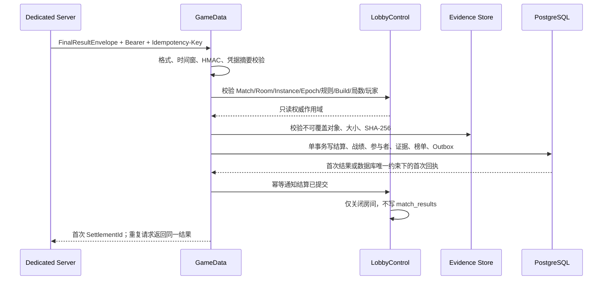

# 阶段 7：GameDataApp 与可信结算闭环实施报告

日期：2026-07-31  
范围：仅阶段 7；未实现 Economy、复杂赛季、NATS 正式流量或现金相关能力。

## 1. 实施前真实状态

- 最终写入口位于 Lobby：`POST /internal/matches/{matchId}/result`。Lobby 校验结果凭据、实例、玩家集合和洗牌证明后，写 `public.match_results` 并关闭房间。
- 旧幂等键为 `match_id + result_sequence`；没有阶段 7 要求的 `match_id + round_no + settlement_version` 数据库唯一约束。
- Dedicated Server 已具备阶段 6 的动作链、快照、状态哈希、洗牌承诺和磁盘 Outbox，但旧结果正文没有完整绑定 `room_epoch`、规则版本、Server Build、证据清单和独立 DS 签名。
- PlayerData 管理资产、奖励和部分证据入口，但没有独立权威 GameRecords；本阶段未让 GameData 写钱包、奖励、订单或支付表。
- Admin 已有调查和回放授权流程，但没有权威 ReplayEvidence 目录写入权；本阶段仍保留该权限边界。
- PostgreSQL 中不存在 `settlement`、`game_record`、`replay`、`leaderboard` 和 GameData 独占集成 Schema，也没有 GameData 生产运行身份。
- MinIO/S3 没有可直接复用的生产写入 SDK。阶段 7 因此实现 FileSystem 共享卷和 HTTP 对象网关两种验证器；生产禁止 `MetadataOnly`。

## 2. 本阶段方案与边界

新增独立部署单元 `Services/Apps/GuiyangMahjong.GameData`，内部模块为：

- `Settlement`：信封校验、DS HMAC、Lobby 权威核对、证据验证、幂等事务、Outbox。
- `GameRecords`：结算投影和玩家历史只读查询，不是资产账本。
- `ReplayEvidence`：对象存在性、大小和 SHA-256 验证。
- `Leaderboards`：基础累计榜投影，可从结算事件重建。
- `Administration`：只返回证据元数据，不返回对象正文或私有手牌。
- `Infrastructure`：PostgreSQL、Lobby 内网客户端、迁移启动门禁。

未处理：玩家资产副作用、奖励发放、复杂赛季、Admin 调查 UI、NATS 正式发布器、跨地域复制和对象存储写入器。`SettlementCommitted` 已与结算同事务进入 Outbox，后续消息阶段可接管发布。

## 3. 可信结算链路

DS 短期 `ResultCredential` 只用于 HTTP Authorization，并以 SHA-256 摘要绑定信封和 Lobby 当前实例。信封 HMAC 使用独立 `SettlementSigningKey`，密钥不进入命令行、日志或 Outbox。该分离使 DS 崩溃后 Allocator 可以原样恢复已签名 v2 Outbox，而不需要持有已失效的短期结果凭据。

## 4. API 变化

| 方法 | 路径 | 调用方 | 认证 | 写入与幂等 |
|---|---|---|---|---|
| POST | `/internal/settlements/{matchId}` | DS | DS 短期 Bearer + 独立 HMAC | 写 GameData；`match:round:version` |
| POST | `/internal/settlements/{matchId}/recovery` | Allocator | 恢复专用 Bearer + 原 DS HMAC | 同一正式事务和唯一约束 |
| POST | `/internal/settlements/{matchId}/shadow-validate` | 迁移镜像/回放工具 | DS Bearer + HMAC | 完整验证但明确 `Committed=false`，零写入 |
| GET | `/internal/monitoring/matches/{matchId}` | Admin/内部查询 | GameData 只读令牌 | 只读最新战绩 |
| GET | `/internal/monitoring/players/{playerId}/records` | Admin/内部查询 | GameData 只读令牌 | 只读玩家战绩 |
| GET | `/internal/monitoring/evidence/{evidenceId}` | 调查流程 | GameData 只读令牌 | 只返回清单和摘要 |
| GET | `/internal/monitoring/leaderboards/basic` | 内部查询 | GameData 只读令牌 | 只读可重建投影 |
| GET | `/health/live|ready|startup` | 编排器 | 集群内探针 | 无业务写入 |
| POST | `/internal/settlement-authority/validate` | GameData → Lobby | 用途隔离令牌 | 只读当前 Room 权威状态 |
| POST | `/internal/settlement-authority/committed` | GameData → Lobby | 用途隔离令牌 | 幂等关闭房间，不写旧结算表 |

外部玩家 API 响应结构未改变；EdgeGateway 未增加 GameData 玩家路由；UE UDP/原生网络路径未改变。Lobby 在 `GameData` 模式对旧非恢复结算入口返回 426，`Legacy` 可作为显式回滚开关。

## 5. FinalResultEnvelope

强信封实际包含：`match_id`、`room_id`、`round_no`、`settlement_version`、`server_instance_id`、`room_epoch`、`ruleset_version`、`server_build`、`workload_credential_hash`、`final_state_hash`、`action_log_hash`、`random_commitment`、`player_results`、`evidence_id`、`evidence_manifest`、`generated_at`、`server_signature`。

签名规范串固定排序玩家座位和证据类型，并绑定全部上述安全字段。GameData 同时校验：

- GUID、版本、摘要、时间窗口、座位和玩家唯一性；
- DS HMAC 与短期凭据摘要；
- Lobby 当前实例、`room_epoch`、规则版本、构建版本、最终局数和参与玩家；
- 快照与动作对象的内容寻址路径、声明大小和 SHA-256；
- 业务幂等键和同键不同载荷冲突。

## 6. 数据库与所有权

| Schema | 权威表/投影 | 唯一写入者 |
|---|---|---|
| `settlement` | `final_results`、`compensations` | GameData；补偿接口本阶段未开放 |
| `game_record` | `matches`、`participants` | GameData 结算事务 |
| `replay` | `evidence_manifests` | GameData 结算事务 |
| `leaderboard` | `player_scores` | GameData 投影 |
| `game_data_integration` | `platform_outbox` | GameData |

没有复用 Identity 已拥有的 `integration` Schema，从而避免同名表和跨服务所有权冲突。`settlement.final_results` 唯一约束为 `(match_id, round_no, settlement_version)`；首次响应随记录持久化语义返回。结算、补偿、战绩和证据表安装拒绝 UPDATE/DELETE/TRUNCATE 的触发器；纠错只能追加补偿记录。

生产身份：

- `mahjong_migration`：部署作业使用，执行 DDL 和所有权调整；不注入应用 Pod。
- `mahjong_game_data`：LOGIN/NOINHERIT，显式激活 `mahjong_game_data_rw`；只有 GameData 自有 Schema DML。
- `mahjong_monitor_ro`：跨域只读；无 DDL 和业务写权限。

迁移：`Storage/schema.sql`。回滚：`Migrations/0001_game_data.down.sql`。回滚会删除 GameData 历史，只允许在未切流，或完成备份、停写和审批后执行。

## 7. Redis、事件和对象存储

- Redis：本阶段没有新增键、锁或权威状态；结算正确性完全依赖 PostgreSQL 事务和唯一约束。
- 事件：事务内写版本化 `SettlementCommitted` 到 `game_data_integration.platform_outbox`。没有引入正式 NATS 流量。
- 证据：DS 在结算屏障后把最终快照和动作日志写入 `matches/{match}/epochs/{epoch}/{sha256}/{kind}` 不可覆盖路径。普通日志不记录私有手牌、Ticket、Token 或密钥。
- FileSystem 模式用于共享 RWX 恢复卷；HTTP Gateway 模式用于 MinIO/S3 兼容对象网关。生产配置拒绝 `MetadataOnly`。

## 8. 配置与部署

关键环境变量：

- GameData：`GameData__PersistenceMode`、`GameData__PostgresConnectionString`、`GameData__LobbyBaseUrl`、`GameData__LobbyAuthorityToken`、`GameData__MonitoringToken`、`GameData__SettlementSigningKey`、`GameData__AllocatorRecoveryToken`、`GameData__EvidenceStorage__*`。
- Lobby：`Lobby__Settlement__Mode`、`Lobby__Settlement__GameDataBaseUrl`、`Lobby__Settlement__AuthorityToken`。
- Allocator：`Allocator__GameDataInternalUrl`、`Allocator__SettlementSigningKey`、`Allocator__GameDataRecoveryToken`。
- DS：`MAHJONG_GAMEDATA_INTERNAL_URL`、`MAHJONG_SETTLEMENT_SIGNING_KEY`、`MAHJONG_MATCH_RESULT_OUTBOX_DIRECTORY`。

Compose 新增 `game-data`，只绑定宿主机回环端口；Kubernetes 新增内部 Service、两副本 Deployment、PDB、只读证据卷、资源限制和三类探针，没有公网 Ingress。Agones Fleet 从 Secret 注入结算密钥；多 Pod Outbox 按 `server_instance_id` 派生文件名。Allocator 和 GameData 挂载同一恢复 PVC，但 GameData 为只读。

## 9. 兼容迁移与回滚

推荐切换顺序：

1. 发布数据库 Schema、GameData 和只读查询，不改变 Lobby `Legacy` 正式写入。
2. 使用 `/shadow-validate` 对采集的 v2 强信封执行零写入验证并对比旧结果；当前仓库未内置流量复制器，生产需由发布流水线/服务网格或受控回放工具驱动该接口。
3. 差异归零后发布携带 v2 Outbox 的 DS/Allocator。
4. 将 `Lobby__Settlement__Mode=GameData`，DS 正式提交 GameData；Lobby 停止写 `match_results`，只接收关闭回调。
5. 观察重复率、拒绝原因、证据失败和回调重试；完成数据核对后再安排后续阶段删除旧写路径。

快速回滚：停止分配新 DS，将 Lobby 模式改回 `Legacy`，回滚到仍能生成旧结果载荷的上一版 DS，再逐步排空新实例。不要直接对已由 GameData 提交的比赛重新执行旧资产副作用；本阶段没有资产双写。数据库 Schema 和历史默认保留，除非走审批后的破坏性 down 脚本。

## 10. 验证结果

- `dotnet restore Services/GuiyangMahjong.Services.slnx`：通过。
- `dotnet build ... --no-restore`：通过，0 警告、0 错误。
- `dotnet test ... --no-build --no-restore`：253 通过，23 跳过，0 失败。跳过项为需要外部 PostgreSQL/Redis 的既有条件测试。
- GameData 新增测试：19 项，覆盖正常、重复、并发重复、首次响应重放、同键冲突、错误实例/Epoch/规则/Build/局数/玩家、摘要、签名、证据不可用、事务失败、影子零写入、Schema 和回滚契约。
- PostgreSQL 17 临时容器：GameData 升级、不可变触发器、down 回滚通过；全服务 Schema → 最小权限授权链通过。
- `docker compose ... config --quiet`：通过。
- GameData Docker 镜像构建：通过。
- Kubernetes/Agones：4 个 YAML 文件离线解析通过。由于本机无可连接集群，`kubectl --dry-run=client` 仍需要 API discovery 而失败，未完成集群准入/CRD 校验。
- Unreal：静态复核了 Server Target/Build.cs 边界及修改调用链；本机 `H:\UE58_Source` 缺少 `Build.bat`、UnrealBuildTool 和 `UnrealEditor-Cmd.exe`，因此无法执行 Server 构建和自动化测试，不能宣称 UE 二进制验证通过。

## 11. 验收结论与下一阶段前置条件

阶段 7 的 .NET、数据库、容器和可信结算核心实现已完成；Lobby 在正式模式不再写最终结算，重复提交不产生重复投影，战绩/证据/基础榜单可通过内部只读接口查询。当前验收为“有条件通过”：进入下一阶段前必须在具备 UE 5.8 完整工具链和 Agones CRD 的 CI/测试集群完成以下门禁：

1. 编译 Client 和 Dedicated Server Target，并运行 `Guiyang.Server.*` 自动化测试；
2. 用真实 DS 完成一局，验证 v2 Outbox、GameData 正式提交、响应丢失重放和 Lobby 关闭回调；
3. 在 Agones 测试集群校验 Fleet、共享 RWX PVC、Allocator 恢复和旧 Epoch 拒绝；
4. 在生产切流前运行受控 shadow 对比，并保存差异报告和审批记录。
