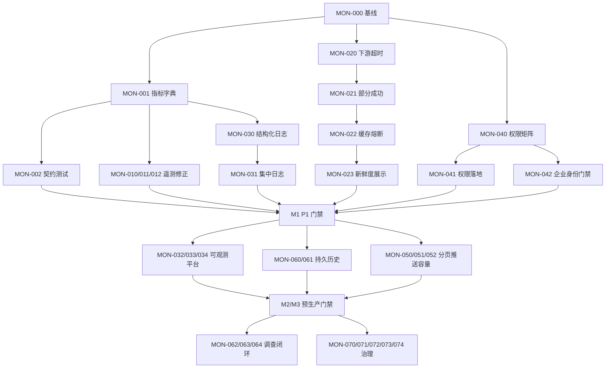

# 服务器、房间与玩家实时监控管理应用下一步执行计划

> 计划日期：2026-07-29  
> 输入文档：`Docs/REALTIME_SERVER_PLAYER_MONITORING_REVIEW_20260728.md`  
> 计划性质：实施计划；工作流 A/B 已进入执行记录阶段  
> 建议周期：P1 上线门禁 2～3 周；预生产能力 5～8 周；完整调查闭环 10～16 周  
> 当前状态：工作流 A 已完成代码与契约基线；工作流 B 已完成实现与自动化验证，完整链接和运行时压测待环境门禁

## 0. 执行状态（2026-07-29）

| 任务 | 状态 | 当前证据 |
|---|---|---|
| MON-000 | 已完成 | 服务基线、测试基线和回退提交已记录 |
| MON-001 | 已完成 | `Contracts/Monitoring/runtime-telemetry-v1.md` 已冻结并校准 |
| MON-002 | 已完成 | Dedicated Server → Lobby → Admin 契约测试已建立 |
| MON-010 | 实现完成，运行校准待门禁 | Windows/Linux 四个改动单元均编译；完整链接因源码引擎触发 490 个动作且内存不足未完成 |
| MON-011 | 实现完成，压测待门禁 | GameNetDriver 累计量、回绕/重置保护和 Lobby 速率测试已完成 |
| MON-012 | 实现完成，场景演练待门禁 | 托管时间、掉线原因、连接序号、EventId 与 Redis 原子幂等已实现 |
| MON-013 | 实现完成，RPC 风暴压测待门禁 | 固定方法白名单、累计异常、P95/P99 有界窗口与 Admin 展示已实现 |
| MON-014 | 核心投影完成，补偿联动待实施 | 只读结算投影、SHA-256、Lobby Completed 权威确认和回归测试已实现 |

工作流 B 详细验收记录见
`claudedocs/phase_monitoring_workflow_b_status_20260729.md`。

## 1. 计划目标

本计划把审查报告中的 P1、P2、P3 发现转化为可排期、可分工、可验证的实施任务，目标是将当前“可用于联调和预生产验证”的实时监控管理应用提升为：

1. 遥测数据真实、完整并且有明确采样口径；
2. 任一依赖服务故障时，监控页面仍能部分可用；
3. 具备指标、日志、追踪、告警和历史趋势能力；
4. 数据库权限、企业身份和不可变审计满足生产要求；
5. 大规模房间和玩家场景下仍能低延迟工作；
6. 房间事件、玩家历史、回放、日志和合规聊天能够支持完整争议调查；
7. 所有管理操作继续保持二次确认、职责分离和不可抵赖审计；
8. 普通运营人员始终不能直接修改牌局或结算结果。

## 2. 实施原则

- **先数据正确，再建设看板**：CPU、内存、网络、掉线、托管和结算口径未校准前，不以页面显示字段作为完成证据。
- **先 P1 门禁，再扩展功能**：P1 未通过前，不宣布生产就绪。
- **每项能力必须端到端验收**：从 Dedicated Server/业务服务生产数据，到存储、聚合 API、管理台显示和告警均需有证据。
- **默认故障关闭**：涉及管理命令、聊天、支付、资产和敏感证据时，上游异常不得自动放宽权限。
- **只追加，不改写历史**：房间事件、玩家连接史、资产流水和审计记录采用 append-only 语义。
- **不破坏现有管理安全链**：不得绕过目标复输、独立审批、状态序列/哈希、工单、原因和 TraceId。
- **中文注释同步门禁**：新增或修改的类、结构、枚举、接口、成员、公共方法、RPC、异步回调和关键安全分支必须同步维护准确中文注释。
- **小步发布、可回退**：遥测、聚合、推送和新存储通过特性开关分阶段启用，保留上一稳定读取路径至少一个发布周期。

## 3. 范围与非目标

### 3.1 本计划范围

- UE Dedicated Server 遥测采集与心跳协议；
- Lobby 房间运行快照、事件和玩家位置；
- Allocator 实例、集群和节点信息；
- Auth 玩家、会话、设备和账号控制信息；
- PlayerData 资产和证据投影；
- Admin 聚合 API、管理台、管理命令和审计；
- PostgreSQL、Redis、时序、日志、追踪和不可变归档；
- Docker Compose、Kubernetes、CI 和生产发布门禁。

### 3.2 非目标

- 不重写已经工作的房间管理、玩家管理和资产审批状态机；
- 不允许新增直接改写对局结果的 GM 能力；
- 不在 P1 阶段开发完整回放播放器或聊天归档产品；
- 不在完成容量测试前承诺具体最大在线人数；
- 不用日志平台代替权威业务数据库，也不用 Redis 短期事件代替合规证据库。

## 4. 里程碑与发布门禁

| 里程碑 | 建议周期 | 目标 | 发布结论 |
|---|---:|---|---|
| M0 基线与契约冻结 | 2～3 人日 | 冻结现状、指标字典、测试基线和回退点 | 允许开始并行开发 |
| M1 P1 生产门禁 | 2～3 周 | 遥测正确、聚合可降级、集中日志可检索、数据库权限隔离 | 允许受控生产试运行 |
| M2 可观测性与历史 | 3～5 周 | OTel、指标、追踪、告警、时序和持久事件 | 允许预生产容量与故障演练 |
| M3 实时化与规模化 | 2～3 周 | 分页、增量推送、长期玩家历史、多数据源发现 | 允许目标规模灰度 |
| M4 调查闭环与治理 | 4～8 周 | 回放、日志证据包、合规聊天、ABAC、WORM/SIEM | 允许完整运营调查闭环 |

## 5. 工作流与任务清单

任务状态初始均为“未开始”。工期为建议工程人日，不含外部采购、法务审批和生产变更窗口。

### 工作流 A：基线、数据字典与契约

#### MON-000 建立实施基线

- 优先级：P1
- 建议负责人：技术负责人、QA
- 估算：1 人日
- 依赖：无
- 交付物：
  - 当前 102 个测试方法的实际执行报告；
  - 一键启动后的服务健康、Admin 总览、房间详情、玩家详情截图和接口结果；
  - 当前遥测心跳样本、管理命令样本和审计链样本；
  - 可回退版本或提交标记。
- 验收：
  - Auth、Lobby、Allocator、PlayerData、Admin 和数据库/缓存全部健康；
  - 原有房间与玩家监控、审批和审计回归通过；
  - 失败项形成独立缺陷，不带病建立新基线。

#### MON-001 冻结监控指标字典

- 优先级：P1
- 建议负责人：服务端、UE、SRE
- 估算：2 人日
- 依赖：MON-000
- 交付物：
  - CPU、RSS、网络、Tick、FPS、RPC、延迟、掉线、托管和结算字段定义；
  - 单位、采样周期、累计/瞬时/区间语义、有效范围和空值语义；
  - 数据所有者、来源、时间戳和版本字段；
  - 心跳协议版本兼容规则。
- 验收：
  - 不再使用含义不清的“内存”“网络流量”“RPC 数量”；
  - 每个字段都能指出权威生产者和交叉验证方法；
  - 新旧心跳协议可以在滚动升级期间共存。

#### MON-002 建立端到端遥测契约测试

- 优先级：P1
- 建议负责人：QA、UE、服务端
- 估算：3 人日
- 依赖：MON-001
- 交付物：
  - Dedicated Server → Lobby → Admin 的字段完整性测试；
  - 单位、范围、空值、时间戳、协议版本和兼容性测试；
  - “模型存在但长期不上报”的失败断言。
- 验收：
  - CI 能主动发现 CPU/网络/托管等字段未上报；
  - 旧版本服务器接入时有明确兼容状态，不产生误导性零值。

### 工作流 B：Dedicated Server 遥测正确性

#### MON-010 修正进程 CPU 与内存采集

- 优先级：P1
- 建议负责人：UE/平台工程师
- 估算：3 人日
- 依赖：MON-001
- 主要修改范围：
  - `Source/GuiyangMahjongServer`
  - Lobby 心跳 DTO
  - Admin 运行遥测模型与页面
- 交付物：
  - Dedicated Server 进程 CPU 百分比；
  - 进程 RSS/工作集字节数；
  - 采样窗口、平台差异和不可用状态；
  - 对应中文注释与自动化测试。
- 验收：
  - Windows 与 Linux 至少各完成一次交叉验证；
  - RSS 与操作系统进程工具的误差满足指标字典约定；
  - 不再把系统总已用内存标记为游戏服务器进程内存。

#### MON-011 增加进程网络流量采集

- 优先级：P1
- 建议负责人：UE/平台工程师
- 估算：3 人日
- 依赖：MON-001
- 交付物：
  - 入站/出站累计字节；
  - 由 Lobby 或 Admin 计算的时间窗口速率；
  - 计数器重置、进程重启和溢出处理。
- 验收：
  - 页面同时显示累计值、每秒速率和采样时间；
  - 重启后不会产生负速率或异常尖峰；
  - 压测流量与系统工具趋势一致。

#### MON-012 补齐托管与掉线遥测

- 优先级：P1
- 建议负责人：UE 游戏逻辑、Lobby
- 估算：3 人日
- 依赖：MON-001
- 交付物：
  - 玩家托管状态及变更时间；
  - 掉线开始、恢复时间、掉线原因分类；
  - 连接变化事件幂等键和状态序列。
- 验收：
  - 正常退出、网络中断、超时、踢出和服务器关闭能够区分；
  - 玩家详情和房间时间线显示一致；
  - 重复心跳不会重复产生连接事件。

#### MON-013 深化 RPC 指标

- 优先级：P2
- 建议负责人：UE 网络工程师、SRE
- 估算：4 人日
- 依赖：MON-001、MON-010
- 交付物：
  - RPC 每秒速率、按方法分类的调用量；
  - 拒绝、失败和超时数量；
  - P95/P99 处理耗时；
  - 高基数标签限制策略。
- 验收：
  - 可以识别单房间 RPC 风暴；
  - 不以 PlayerId 作为无限基数指标标签；
  - 产生异常时能关联到 RoomId、ServerInstanceId 和 TraceId。

#### MON-014 建立显式结算状态投影

- 优先级：P2
- 建议负责人：Lobby、Admin、数据工程师
- 估算：5 人日
- 依赖：MON-001
- 交付物：
  - `Calculating/Submitted/Accepted/Failed/Compensating/Completed` 等受控状态；
  - MatchId、ResultSequence、结果哈希、提交/确认时间、失败原因和关联案件；
  - 只读监控接口和管理台展示。
- 验收：
  - 重复提交仍只确认一次；
  - 普通运营角色只能查看，不能编辑结算内容；
  - 补偿必须通过现有审批与资产操作链路。

### 工作流 C：Admin 聚合可靠性

#### MON-020 为所有监控下游设置独立超时

- 优先级：P1
- 建议负责人：Admin 服务端
- 估算：2 人日
- 依赖：MON-000
- 交付物：
  - Auth、Lobby、Allocator 和 PlayerData 独立超时配置；
  - 取消传播、超时错误类型和中文运维信息；
  - 超时指标。
- 验收：
  - 单个下游卡住不会占满 Admin 请求线程；
  - 总览响应时间有确定上限。

#### MON-021 实现部分成功聚合

- 优先级：P1
- 建议负责人：Admin 服务端
- 估算：4 人日
- 依赖：MON-020
- 交付物：
  - 每个数据源的 `Healthy/Degraded/Unavailable/Stale` 状态；
  - 部分成功响应契约；
  - 来源错误、最后成功时间和数据年龄；
  - 不泄露内部地址或凭据的错误摘要。
- 验收：
  - Allocator 故障时仍能查看房间和玩家；
  - Auth 故障时房间监控仍可使用；
  - 页面明确显示缺失字段来自哪个数据源。

#### MON-022 增加最后成功快照与熔断

- 优先级：P1
- 建议负责人：Admin 服务端、SRE
- 估算：4 人日
- 依赖：MON-021
- 交付物：
  - 有界缓存、TTL 和版本；
  - 熔断、半开探测、退避和恢复逻辑；
  - 陈旧数据醒目标识。
- 验收：
  - 下游连续失败时不会形成请求风暴；
  - 陈旧数据不能被误认为实时数据；
  - 缓存不包含未授权敏感证据。

#### MON-023 管理台数据新鲜度与降级展示

- 优先级：P1
- 建议负责人：前端、Admin 服务端
- 估算：3 人日
- 依赖：MON-021、MON-022
- 交付物：
  - 总览和详情来源健康卡片；
  - 最后观测时间、数据年龄和陈旧阈值；
  - 降级/不可用中文提示。
- 验收：
  - 人工关闭任一依赖后，页面不白屏；
  - 操作员能判断数据是否适合发起高危操作；
  - 高危操作基于陈旧状态时继续由状态校验拒绝。

### 工作流 D：结构化日志、指标、追踪与告警

#### MON-030 统一结构化日志规范

- 优先级：P1
- 建议负责人：SRE、各服务负责人
- 估算：4 人日
- 依赖：MON-001
- 交付物：
  - 日志字段规范：Timestamp、Level、Service、Environment、TraceId、RoomId、PlayerId、MatchId、ServerInstanceId、EventId；
  - 敏感字段禁止清单；
  - 所有服务和 UE 的日志适配；
  - 日志字段契约测试。
- 验收：
  - 能使用单个 RoomId 串联 Lobby、Allocator、Admin 和 Dedicated Server；
  - 密码、完整令牌、支付敏感字段和未脱敏 IP 不进入日志；
  - 日志格式错误会使 CI 门禁失败。

#### MON-031 部署集中日志平台

- 优先级：P1
- 建议负责人：DevOps/SRE
- 估算：4 人日
- 依赖：MON-030
- 交付物：
  - Loki 或 OpenSearch 的开发/预生产部署；
  - 保留、索引、配额和访问控制策略；
  - Admin 的房间日志检索/导出适配，不直接暴露日志平台管理员凭据。
- 验收：
  - 按 RoomId、PlayerId、ServerInstanceId、MatchId 和 TraceId 检索；
  - 导出动作要求工单、权限和审计；
  - 普通运营角色不能查询无关玩家的原始日志。

#### MON-032 接入 OpenTelemetry 追踪

- 优先级：P2
- 建议负责人：SRE、.NET 服务端、UE
- 估算：5 人日
- 依赖：MON-030
- 交付物：
  - Admin → Auth/Lobby/Allocator/PlayerData 的上下文传播；
  - Lobby → 关键内部操作的跨度；
  - OTel Collector 和 Tempo/Jaeger；
  - 采样和敏感属性过滤策略。
- 验收：
  - 单个管理查询和管理命令可查看完整调用链；
  - 管理动作的业务 TraceId 与技术追踪可关联；
  - 不在跨度属性中记录令牌、聊天内容或支付敏感字段。

#### MON-033 建立 Prometheus 指标与 Grafana 看板

- 优先级：P2
- 建议负责人：SRE、各服务负责人
- 估算：6 人日
- 依赖：MON-010、MON-011、MON-020
- 交付物：
  - 服务 RED 指标和资源 USE 指标；
  - 房间数、玩家数、心跳、Tick、掉线、RPC、命令/审计发件箱指标；
  - 管理系统、房间集群、Dedicated Server 和审批队列看板。
- 验收：
  - 指标标签通过高基数审查；
  - 看板能从集群下钻到节点、实例和房间；
  - 页面总览值与指标平台在同一统计口径下相符。

#### MON-034 建立首批告警和处理手册

- 优先级：P2
- 建议负责人：SRE、运营负责人
- 估算：4 人日
- 依赖：MON-031、MON-033
- 交付物：
  - 心跳丢失、CPU/RSS、Tick、掉线率、RPC 风暴、错误率、命令积压、审计归档积压告警；
  - 分级、抑制、聚合、静默和升级策略；
  - 每个告警对应的中文处理手册。
- 验收：
  - 心跳丢失 30 秒内触发告警；
  - 同一集群故障不会产生无法处理的告警风暴；
  - 演练能够从告警跳转到相关日志、指标和追踪。

### 工作流 E：数据库最小权限与生产身份

#### MON-040 建立 PostgreSQL 角色矩阵

- 优先级：P1
- 建议负责人：DBA、安全工程师、服务端
- 估算：3 人日
- 依赖：MON-000
- 交付物：
  - 迁移、应用读写、只读监控、审计追加、归档分发角色；
  - Schema/Table/Sequence/Function 权限矩阵；
  - 凭据轮换和吊销流程。
- 验收：
  - 应用运行账号不能执行 DDL；
  - 审计写入账号不能 UPDATE、DELETE 或 TRUNCATE 审计表；
  - 服务不能访问无关 Schema。

#### MON-041 落实数据库权限迁移与部署配置

- 优先级：P1
- 建议负责人：DBA、DevOps
- 估算：4 人日
- 依赖：MON-040
- 交付物：
  - 可重复执行的角色/授权迁移；
  - Compose 和 Kubernetes 独立凭据配置；
  - Secret 管理和轮换说明；
  - 向后兼容迁移顺序与回退方案。
- 验收：
  - CI 使用真实 PostgreSQL 验证越权操作被拒绝；
  - 配置文件和日志不包含实际生产秘密；
  - 旧共享账号可以在迁移完成后禁用。

#### MON-042 启用企业身份和生产安全门禁

- 优先级：P1
- 建议负责人：安全工程师、DevOps、Admin 服务端
- 估算：4 人日
- 依赖：MON-040
- 交付物：
  - OIDC/JWT、MFA、角色映射和短会话配置；
  - 禁止生产使用本地共享 Bearer 的启动校验；
  - 管理命令执行、WORM 归档和企业身份配置的生产预检。
- 验收：
  - 未启用企业身份或 MFA 时生产实例拒绝就绪；
  - 未配置审计归档时高危管理命令不能生产启用；
  - 角色变更和离职吊销能在约定时限内生效。

#### MON-043 管理台 Web 安全加固

- 优先级：P2
- 建议负责人：安全工程师、前端、DevOps
- 估算：4 人日
- 依赖：MON-042
- 交付物：
  - HTTPS、HSTS、严格 CSP 和安全响应头；
  - 短期会话和退出失效；
  - 读接口、搜索、敏感证据和导出的独立限流；
  - XSS、越权和批量导出测试。
- 验收：
  - 不再依赖长期共享令牌；
  - CSP 测试无不必要的 `unsafe-inline`/`unsafe-eval`；
  - 普通运营无法通过前端或直接调用接口越权。

### 工作流 F：分页、推送与容量

#### MON-050 房间与玩家服务端游标分页

- 优先级：P2
- 建议负责人：Admin、Lobby、Auth
- 估算：6 人日
- 依赖：MON-021
- 交付物：
  - 稳定排序、游标、页大小上限和过滤条件；
  - 房间、玩家和实例列表分页契约；
  - 旧 `limit=5000/2000` 路径迁移方案。
- 验收：
  - 翻页期间新增/删除数据不会导致大面积重复或遗漏；
  - 页大小不能由客户端无限放大；
  - 权限和脱敏在分页前执行。

#### MON-051 建立 SSE/WebSocket 增量事件

- 优先级：P2
- 建议负责人：Admin、前端
- 估算：6 人日
- 依赖：MON-050、MON-023
- 交付物：
  - 初始分页快照 + 增量事件协议；
  - 事件序列、断线续传、积压上限和重新同步；
  - 5 秒全量轮询的兼容开关。
- 验收：
  - 断线重连后不丢关键状态；
  - 客户端落后超过窗口时自动执行受控全量重同步；
  - 稳态请求量显著低于原 5 秒全量轮询。

#### MON-052 目标规模压力测试

- 优先级：P2
- 建议负责人：QA、性能工程师、SRE
- 估算：5 人日
- 依赖：MON-050、MON-051、MON-033
- 交付物：
  - 10 万玩家、1 万房间或经产品确认后的目标规模模型；
  - API、数据库、Redis、推送连接和浏览器性能报告；
  - 容量基线和扩容阈值。
- 验收：
  - 达到约定 P95/P99 延迟、错误率和资源阈值；
  - 页面滚动、搜索和详情打开满足人工操作要求；
  - 测试结果能重现并进入发布门禁。

### 工作流 G：持久历史与调查闭环

#### MON-060 建立持久房间事件存储

- 优先级：P2
- 建议负责人：数据工程师、Lobby
- 估算：5 人日
- 依赖：MON-001
- 交付物：
  - append-only 房间事件表/事件库；
  - EventId、RoomId、MatchId、Sequence、TraceId 和幂等约束；
  - Redis 作为热数据、持久库作为历史权威的双层读取。
- 验收：
  - Redis 过期后仍可查询合规保留期内的事件；
  - 重复投递不会产生重复历史；
  - 事件不可被普通应用账号修改或删除。

#### MON-061 建立玩家房间与连接历史

- 优先级：P2
- 建议负责人：Lobby、Admin、数据工程师
- 估算：5 人日
- 依赖：MON-012、MON-060
- 交付物：
  - `player_room_history`；
  - `player_connection_history`；
  - 玩家详情分页历史查询；
  - 保留、脱敏和访问控制。
- 验收：
  - 不再从当前最多 20 个房间反推玩家历史；
  - 可以准确回答进入、离开、掉线、恢复和托管时间；
  - 查询全程产生必要审计。

#### MON-062 回放查看端到端能力

- 优先级：P2
- 建议负责人：游戏服务端、Admin、前端、安全工程师
- 估算：8～12 人日
- 依赖：MON-060、MON-042
- 交付物：
  - 回放目录、完整性哈希和对象存储；
  - 短时签名 URL；
  - Web 播放器或受控下载；
  - 查看原因、工单、授权和审计。
- 验收：
  - 未授权用户不能获取对象地址；
  - URL 过期后失效，不能跨案件复用；
  - 回放内容与 MatchId、结果哈希和事件时间线可核对。

#### MON-063 房间日志与案件证据包

- 优先级：P2
- 建议负责人：Admin、SRE、案件系统负责人
- 估算：6 人日
- 依赖：MON-031、MON-060、MON-062
- 交付物：
  - 按 CaseId 汇集日志、事件、回放元数据、资产流水和审计记录；
  - 清单哈希、生成时间、数据范围和操作者；
  - 受控导出和过期策略。
- 验收：
  - 证据包可验证完整性；
  - 导出不会包含超出案件范围的玩家数据；
  - 生成、下载和删除/过期操作均留审计。

#### MON-064 合规聊天归档与查询网关

- 优先级：P2/P3，取决于业务合规要求
- 建议负责人：安全、法务、聊天服务、Admin
- 估算：10～15 人日
- 依赖：MON-042、数据保留政策确认
- 交付物：
  - 独立聊天归档；
  - 基于工单/案件、时间范围、玩家范围和用途的最小授权；
  - 内容脱敏、水印、防批量抓取和访问审计；
  - 法务确认的保留与删除策略。
- 验收：
  - Admin 不直接持有聊天库超级权限；
  - 查询超出授权范围时默认拒绝；
  - 每次内容查看均能追溯操作人、原因、工单和 TraceId。

### 工作流 H：多集群、SLO 与治理

#### MON-070 多 Region/Cluster/Lobby/Node 动态发现

- 优先级：P2
- 建议负责人：架构师、Lobby、Allocator、Admin
- 估算：7 人日
- 依赖：MON-021、MON-050
- 交付物：
  - 服务注册元数据和唯一标识；
  - 多 Lobby/Allocator 数据源动态发现；
  - 聚合、路由冲突和部分地域故障处理；
  - 管理台按地域/集群/大厅/节点筛选。
- 验收：
  - 不再把所有玩家大厅标记为固定 `primary`；
  - 单地域故障不影响其他地域监控；
  - ID 冲突和重复注册有确定处理规则。

#### MON-071 定义并实现首批 SLO

- 优先级：P2
- 建议负责人：SRE、产品负责人、服务负责人
- 估算：3 人日
- 依赖：MON-033、MON-034
- 目标建议：
  - 监控 API 月可用性 ≥ 99.9%；
  - 遥测端到端新鲜度 P95 ≤ 10 秒；
  - 高危命令批准到开始执行 P95 ≤ 5 秒；
  - 审计归档到 WORM P95 ≤ 60 秒；
  - 心跳丢失 30 秒内告警。
- 验收：
  - 每项 SLO 有 SLI、计算公式、窗口、错误预算和负责人；
  - Grafana 能显示当前达标状态；
  - 错误预算耗尽时有发布限制规则。

#### MON-072 WORM/SIEM 正式接入和审计链锚定

- 优先级：P2
- 建议负责人：安全、SRE、DBA
- 估算：6 人日
- 依赖：MON-041、MON-042、MON-032
- 交付物：
  - 生产 WORM/SIEM 归档；
  - 审计链周期校验与外部锚定；
  - 归档积压、失败和完整性告警；
  - 恢复与取证手册。
- 验收：
  - 修改数据库管理员权限范围内的数据后能够检测异常；
  - 归档失败不会静默丢失；
  - 高危管理操作可从 SIEM 反查完整审批和执行链。

#### MON-073 RBAC 深化为 RBAC + ABAC

- 优先级：P3
- 建议负责人：安全架构师、Admin
- 估算：8 人日
- 依赖：MON-042、MON-070
- 交付物：
  - 地域、班次、案件归属、金额阈值、数据级别和紧急状态策略；
  - 策略决策日志；
  - 紧急破窗访问和事后复核流程。
- 验收：
  - 角色相同但无案件归属的人员不能查看敏感内容；
  - 高金额补偿触发更高审批级别；
  - 破窗操作有强 MFA、短时授权和自动告警。

#### MON-074 故障、容灾和安全演练

- 优先级：P2/P3
- 建议负责人：QA、SRE、安全、各服务负责人
- 估算：6 人日
- 依赖：M2 任务完成
- 交付物：
  - 下游超时、Redis/PostgreSQL 故障、日志/指标平台故障、发件箱积压、跨集群故障演练；
  - 越权、XSS、批量导出、审计逃逸和凭据轮换演练；
  - RTO/RPO 结果和整改项。
- 验收：
  - 监控降级行为符合设计；
  - 管理命令不会因重试重复执行；
  - 审计、资产和结算数据不丢失、不重复。

## 6. 依赖关系与推荐执行顺序

### 6.1 第一批必须串行完成

1. MON-000 建立基线；
2. MON-001 冻结指标字典；
3. MON-002 建立遥测契约；
4. 在契约稳定后修改 Dedicated Server、Lobby 和 Admin。

### 6.2 可以并行的工作

基线完成后可启动四个并行小组：

- 小组 A：MON-010、MON-011、MON-012；
- 小组 B：MON-020、MON-021、MON-022、MON-023；
- 小组 C：MON-030、MON-031；
- 小组 D：MON-040、MON-041、MON-042。

四组全部通过后，才允许关闭 M1 P1 门禁。

## 7. 建议的迭代排期

假设投入：1 名 UE 工程师、2 名 .NET 工程师、1 名前端工程师、1 名 QA、1 名 SRE/DevOps，安全和 DBA 按需参与。

### Sprint 0：基线与设计冻结（第 1 周前半）

- MON-000、MON-001；
- 明确技术选型：Prometheus/Grafana、Loki 或 OpenSearch、Tempo 或 Jaeger；
- 确认数据保留、聊天合规和 WORM 归档要求。

退出条件：指标字典、协议版本和测试基线通过评审。

### Sprint 1：P1 第一部分（第 1～2 周）

- MON-002、MON-010、MON-011、MON-012；
- MON-020、MON-021；
- MON-030；
- MON-040。

退出条件：新遥测端到端可见，单下游故障不会造成总览整体失败。

### Sprint 2：P1 第二部分（第 2～3 周）

- MON-022、MON-023；
- MON-031；
- MON-041、MON-042；
- P1 回归、权限逃逸、故障注入和安全测试。

退出条件：M1 生产门禁全部通过，形成受控试运行报告。

### Sprint 3～4：可观测性与历史（第 4～7 周）

- MON-013、MON-014；
- MON-032、MON-033、MON-034；
- MON-060、MON-061；
- MON-071。

退出条件：可以从告警下钻到指标、日志、追踪和房间/玩家历史。

### Sprint 5：实时化与容量（第 7～9 周）

- MON-050、MON-051、MON-052；
- MON-070。

退出条件：目标规模压力测试通过，前端稳定使用增量推送。

### Sprint 6～8：调查闭环与生产治理（第 10～16 周）

- MON-062、MON-063、MON-064；
- MON-072、MON-073、MON-074；
- 全链路安全、容灾和运营演练。

退出条件：案件能够形成完整证据包，生产身份、WORM/SIEM 和演练门禁通过。

## 8. 每项任务的统一完成定义

每个任务只有同时满足以下条件才能标记“完成”：

1. 设计或契约经过对应负责人评审；
2. 代码实现与实际行为一致；
3. 新增和修改代码包含准确中文注释，失效注释已经清理；
4. 单元、契约、集成和必要的故障测试通过；
5. 权限、脱敏、审计和幂等边界经过安全检查；
6. 指标、日志和错误信息能够支持运维定位；
7. Compose 和 Kubernetes 配置同步更新；
8. 运行手册、回退步骤和已知限制同步更新；
9. 未引入直接修改对局结果的管理接口；
10. 验收证据保存到 `Artifacts` 或对应阶段状态文档。

## 9. M1 P1 上线门禁检查表

- [ ] CPU 使用进程级口径，并通过 Windows/Linux 交叉验证；
- [ ] 内存使用进程 RSS/工作集，不再使用系统总已用内存；
- [ ] 入站/出站网络指标完整并能计算速率；
- [ ] 托管、掉线时间和原因能够端到端显示；
- [ ] 遥测契约测试在 CI 执行；
- [ ] 任一依赖故障时总览部分可用；
- [ ] 页面显示每个数据源的新鲜度和降级状态；
- [ ] 结构化日志能按 RoomId、PlayerId、InstanceId、MatchId、TraceId 检索；
- [ ] 集中日志导出受 RBAC、工单和审计约束；
- [ ] PostgreSQL 独立角色和最小权限验证通过；
- [ ] 生产环境强制企业身份、MFA 和安全启动预检；
- [ ] 原有二次确认、独立审批、状态校验和审计链回归通过；
- [ ] 没有新增直接修改牌局结果或结算结果的能力；
- [ ] 一键启动、就绪探针和回退流程验证通过。

## 10. 风险与控制措施

| 风险 | 可能影响 | 控制措施 | 回退方式 |
|---|---|---|---|
| UE 跨平台指标口径不一致 | 页面数据不可比较 | 指标字典、平台适配层、OS 工具交叉验证 | 保留旧字段但标记废弃和不可信 |
| 新心跳协议滚动升级失败 | 老服务器无法注册或上报 | 协议版本、可选字段、双版本契约测试 | 回退读取旧协议 |
| 聚合降级掩盖真实故障 | 操作员误用陈旧数据 | 醒目标识、数据年龄、高危动作状态复核 | 关闭缓存读取 |
| 指标标签基数爆炸 | Prometheus/日志平台过载 | 禁止 PlayerId 作为全局指标标签，容量测试 | 关闭高基数维度 |
| 数据库权限迁移阻断服务 | 服务无法读写 | 先授权新角色、双凭据验证、后禁用旧账号 | 暂时恢复旧账号并保留审计 |
| SSE/WebSocket 事件丢失 | 页面状态不一致 | 事件序列、断点续传、超窗全量重同步 | 切回分页轮询 |
| 持久事件双写不一致 | 历史证据缺失或重复 | 事务发件箱、幂等键、对账任务 | 保留 Redis 热路径并补偿重放 |
| 回放/聊天造成隐私越权 | 合规和安全事故 | ABAC、工单、短时授权、水印、全量审计 | 关闭内容读取，只保留元数据 |
| WORM/SIEM 不可用 | 审计归档积压 | 本地可靠发件箱、积压告警、容量保护 | 暂停高危操作而非丢弃审计 |

## 11. 首个可执行任务包

建议下一次实施任务只领取以下范围，避免一个变更同时跨越过多系统：

### 任务包 MON-PACK-01：遥测正确性与降级基线

包含：

1. MON-000 建立基线；
2. MON-001 冻结指标字典；
3. MON-002 建立遥测契约测试；
4. MON-010 修正进程 CPU/RSS；
5. MON-020 设置下游独立超时；
6. MON-021 实现部分成功响应；
7. 对应管理台新鲜度基础字段，但不在本任务包内引入 SSE/WebSocket。

预计：10～14 人日，可由 UE、Admin 和 QA 并行完成。

完成后必须交付：

- 指标字典；
- 新旧心跳样本；
- 自动化测试报告；
- 操作系统指标交叉验证报告；
- Allocator/Lobby/Auth 分别断开时的降级验证；
- 代码中文注释审查记录；
- 回退验证记录。

## 12. 计划审批建议

开始实施前，需要项目负责人确认以下决策：

1. 集中日志采用 Loki 还是 OpenSearch；
2. 追踪采用 Tempo 还是 Jaeger；
3. 时序指标的生产保留周期和成本上限；
4. 房间事件、玩家连接史、回放和聊天的合规保留周期；
5. WORM/SIEM 产品与接入环境；
6. 第一阶段目标容量是否采用 10 万玩家、1 万房间；
7. 受控生产试运行的 Region/Cluster 范围和回退负责人。

未确认这些决策不会阻止 MON-PACK-01，但会阻止 M2 相关平台任务进入实施。
